---
search:
  boost: 10.0
---

# Class: MultiInstanceLoopCharacteristics 


_The BPMN 2.0 multiInstanceLoopCharacteristics element type_


<div data-search-exclude markdown="1">


URI: [fluxnova_bpm_platform:MultiInstanceLoopCharacteristics](https://w3id.org/TD-Universe/fluxnova-bpm-platform/MultiInstanceLoopCharacteristics)

```mermaid
 classDiagram
    class MultiInstanceLoopCharacteristics
    click MultiInstanceLoopCharacteristics href "../MultiInstanceLoopCharacteristics/"
      LoopCharacteristics <|-- MultiInstanceLoopCharacteristics
        click LoopCharacteristics href "../LoopCharacteristics/"
      
      MultiInstanceLoopCharacteristics : behavior
        
      MultiInstanceLoopCharacteristics : completion_condition
        
          
    
        
        
        MultiInstanceLoopCharacteristics --> "0..1" CompletionCondition : completion_condition
        click CompletionCondition href "../CompletionCondition/"
    

        
      MultiInstanceLoopCharacteristics : complex_behavior_definitions
        
          
    
        
        
        MultiInstanceLoopCharacteristics --> "*" ComplexBehaviorDefinition : complex_behavior_definitions
        click ComplexBehaviorDefinition href "../ComplexBehaviorDefinition/"
    

        
      MultiInstanceLoopCharacteristics : diagram_element
        
          
    
        
        
        MultiInstanceLoopCharacteristics --> "0..1" DiagramElement : diagram_element
        click DiagramElement href "../DiagramElement/"
    

        
      MultiInstanceLoopCharacteristics : documentations
        
          
    
        
        
        MultiInstanceLoopCharacteristics --> "*" Documentation : documentations
        click Documentation href "../Documentation/"
    

        
      MultiInstanceLoopCharacteristics : extension_elements
        
          
    
        
        
        MultiInstanceLoopCharacteristics --> "0..1" ExtensionElements : extension_elements
        click ExtensionElements href "../ExtensionElements/"
    

        
      MultiInstanceLoopCharacteristics : fluxnova_async_after
        
      MultiInstanceLoopCharacteristics : fluxnova_async_before
        
      MultiInstanceLoopCharacteristics : fluxnova_collection
        
      MultiInstanceLoopCharacteristics : fluxnova_element_variable
        
      MultiInstanceLoopCharacteristics : fluxnova_exclusive
        
      MultiInstanceLoopCharacteristics : id
        
      MultiInstanceLoopCharacteristics : input_data_item
        
          
    
        
        
        MultiInstanceLoopCharacteristics --> "0..1" InputDataItem : input_data_item
        click InputDataItem href "../InputDataItem/"
    

        
      MultiInstanceLoopCharacteristics : loop_cardinality
        
          
    
        
        
        MultiInstanceLoopCharacteristics --> "0..1" LoopCardinality : loop_cardinality
        click LoopCardinality href "../LoopCardinality/"
    

        
      MultiInstanceLoopCharacteristics : loop_data_input_ref
        
          
    
        
        
        MultiInstanceLoopCharacteristics --> "0..1" DataInput : loop_data_input_ref
        click DataInput href "../DataInput/"
    

        
      MultiInstanceLoopCharacteristics : loop_data_output_ref
        
          
    
        
        
        MultiInstanceLoopCharacteristics --> "0..1" DataOutput : loop_data_output_ref
        click DataOutput href "../DataOutput/"
    

        
      MultiInstanceLoopCharacteristics : none_behavior_event_ref
        
          
    
        
        
        MultiInstanceLoopCharacteristics --> "0..1" EventDefinition : none_behavior_event_ref
        click EventDefinition href "../EventDefinition/"
    

        
      MultiInstanceLoopCharacteristics : one_behavior_event_ref
        
          
    
        
        
        MultiInstanceLoopCharacteristics --> "0..1" EventDefinition : one_behavior_event_ref
        click EventDefinition href "../EventDefinition/"
    

        
      MultiInstanceLoopCharacteristics : output_data_item
        
          
    
        
        
        MultiInstanceLoopCharacteristics --> "0..1" OutputDataItem : output_data_item
        click OutputDataItem href "../OutputDataItem/"
    

        
      MultiInstanceLoopCharacteristics : scope
        
          
    
        
        
        MultiInstanceLoopCharacteristics --> "0..1" BpmnModelElementInstance : scope
        click BpmnModelElementInstance href "../BpmnModelElementInstance/"
    

        
      MultiInstanceLoopCharacteristics : sequential
        
      
```





## Inheritance
* [BpmnModelElementInstance](BpmnModelElementInstance.md)
    * [BaseElement](BaseElement.md)
        * [LoopCharacteristics](LoopCharacteristics.md)
            * **MultiInstanceLoopCharacteristics**


## Slots

| Name | Cardinality and Range | Description | Inheritance |
| ---  | --- | --- | --- |
| [loop_cardinality](loop_cardinality.md) | 0..1 <br/> [LoopCardinality](LoopCardinality.md) | Expression evaluating to the number of loop iterations | direct |
| [loop_data_input_ref](loop_data_input_ref.md) | 0..1 <br/> [DataInput](DataInput.md) | The loop data input ref of this element | direct |
| [loop_data_output_ref](loop_data_output_ref.md) | 0..1 <br/> [DataOutput](DataOutput.md) | The loop data output ref of this element | direct |
| [input_data_item](input_data_item.md) | 0..1 <br/> [InputDataItem](InputDataItem.md) | Loop input data item variable | direct |
| [output_data_item](output_data_item.md) | 0..1 <br/> [OutputDataItem](OutputDataItem.md) | Loop output data item variable | direct |
| [complex_behavior_definitions](complex_behavior_definitions.md) | * <br/> [ComplexBehaviorDefinition](ComplexBehaviorDefinition.md) | Rules defining complex multi-instance completion behavior | direct |
| [completion_condition](completion_condition.md) | 0..1 <br/> [CompletionCondition](CompletionCondition.md) | Condition that, when true, terminates remaining instances | direct |
| [sequential](sequential.md) | 0..1 <br/> [Boolean](Boolean.md) | Whether sequential | direct |
| [behavior](behavior.md) | 0..1 <br/> [String](String.md) | Behavior governing how completion events are thrown | direct |
| [one_behavior_event_ref](one_behavior_event_ref.md) | 0..1 <br/> [EventDefinition](EventDefinition.md) | The one behavior event ref of this element | direct |
| [none_behavior_event_ref](none_behavior_event_ref.md) | 0..1 <br/> [EventDefinition](EventDefinition.md) | The none behavior event ref of this element | direct |
| [fluxnova_collection](fluxnova_collection.md) | 0..1 <br/> [String](String.md) | Fluxnova extension property: collection | direct |
| [fluxnova_element_variable](fluxnova_element_variable.md) | 0..1 <br/> [String](String.md) | Fluxnova extension property: element variable | direct |
| [fluxnova_async_before](fluxnova_async_before.md) | 0..1 <br/> [Boolean](Boolean.md) | Whether this element is executed asynchronously before its start | direct |
| [fluxnova_async_after](fluxnova_async_after.md) | 0..1 <br/> [Boolean](Boolean.md) | Whether this element is executed asynchronously after its end | direct |
| [fluxnova_exclusive](fluxnova_exclusive.md) | 0..1 <br/> [Boolean](Boolean.md) | Whether this element participates in an exclusive job execution | direct |
| [id](id.md) | 1 <br/> [String](String.md) | Unique identifier | [BaseElement](BaseElement.md) |
| [documentations](documentations.md) | * <br/> [Documentation](Documentation.md) | Collection of documentation elements associated with this element | [BaseElement](BaseElement.md) |
| [extension_elements](extension_elements.md) | 0..1 <br/> [ExtensionElements](ExtensionElements.md) | Extension elements holding vendor-specific metadata | [BaseElement](BaseElement.md) |
| [diagram_element](diagram_element.md) | 0..1 <br/> [DiagramElement](DiagramElement.md) | The diagram element that visually represents this BPMN element | [BaseElement](BaseElement.md) |
| [scope](scope.md) | 0..1 <br/> [BpmnModelElementInstance](BpmnModelElementInstance.md) | Tests if the element is a scope like process or sub-process | [BpmnModelElementInstance](BpmnModelElementInstance.md) |


## In Subsets


* [Instance](Instance.md)
* [FluxnovaBpmnModel](FluxnovaBpmnModel.md)


## Identifier and Mapping Information


### Annotations

| property | value |
| --- | --- |
| java_package | org.finos.fluxnova.bpm.model.bpmn.instance |
| source_file | model-api/bpmn-model/src/main/java/org/finos/fluxnova/bpm/model/bpmn/instance/MultiInstanceLoopCharacteristics.java |


### Schema Source


* from schema: https://w3id.org/TD-Universe/fluxnova-bpm-platform


## Mappings

| Mapping Type | Mapped Value |
| ---  | ---  |
| self | fluxnova_bpm_platform:MultiInstanceLoopCharacteristics |
| native | fluxnova_bpm_platform:MultiInstanceLoopCharacteristics |


## LinkML Source

<!-- TODO: investigate https://stackoverflow.com/questions/37606292/how-to-create-tabbed-code-blocks-in-mkdocs-or-sphinx -->

### Direct

<details>
```yaml
name: MultiInstanceLoopCharacteristics
annotations:
  java_package:
    tag: java_package
    value: org.finos.fluxnova.bpm.model.bpmn.instance
  source_file:
    tag: source_file
    value: model-api/bpmn-model/src/main/java/org/finos/fluxnova/bpm/model/bpmn/instance/MultiInstanceLoopCharacteristics.java
description: The BPMN 2.0 multiInstanceLoopCharacteristics element type
in_subset:
- instance
- fluxnova_bpmn_model
from_schema: https://w3id.org/TD-Universe/fluxnova-bpm-platform
is_a: LoopCharacteristics
slots:
- loop_cardinality
- loop_data_input_ref
- loop_data_output_ref
- input_data_item
- output_data_item
- complex_behavior_definitions
- completion_condition
- sequential
- behavior
- one_behavior_event_ref
- none_behavior_event_ref
- fluxnova_collection
- fluxnova_element_variable
- fluxnova_async_before
- fluxnova_async_after
- fluxnova_exclusive

```
</details>

### Induced

<details>
```yaml
name: MultiInstanceLoopCharacteristics
annotations:
  java_package:
    tag: java_package
    value: org.finos.fluxnova.bpm.model.bpmn.instance
  source_file:
    tag: source_file
    value: model-api/bpmn-model/src/main/java/org/finos/fluxnova/bpm/model/bpmn/instance/MultiInstanceLoopCharacteristics.java
description: The BPMN 2.0 multiInstanceLoopCharacteristics element type
in_subset:
- instance
- fluxnova_bpmn_model
from_schema: https://w3id.org/TD-Universe/fluxnova-bpm-platform
is_a: LoopCharacteristics
attributes:
  loop_cardinality:
    name: loop_cardinality
    description: Expression evaluating to the number of loop iterations.
    from_schema: https://w3id.org/TD-Universe/fluxnova-bpm-platform
    rank: 1000
    owner: MultiInstanceLoopCharacteristics
    domain_of:
    - MultiInstanceLoopCharacteristics
    range: LoopCardinality
  loop_data_input_ref:
    name: loop_data_input_ref
    description: The loop data input ref of this element.
    from_schema: https://w3id.org/TD-Universe/fluxnova-bpm-platform
    rank: 1000
    owner: MultiInstanceLoopCharacteristics
    domain_of:
    - MultiInstanceLoopCharacteristics
    range: DataInput
  loop_data_output_ref:
    name: loop_data_output_ref
    description: The loop data output ref of this element.
    from_schema: https://w3id.org/TD-Universe/fluxnova-bpm-platform
    rank: 1000
    owner: MultiInstanceLoopCharacteristics
    domain_of:
    - MultiInstanceLoopCharacteristics
    range: DataOutput
  input_data_item:
    name: input_data_item
    description: Loop input data item variable.
    from_schema: https://w3id.org/TD-Universe/fluxnova-bpm-platform
    rank: 1000
    owner: MultiInstanceLoopCharacteristics
    domain_of:
    - MultiInstanceLoopCharacteristics
    range: InputDataItem
  output_data_item:
    name: output_data_item
    description: Loop output data item variable.
    from_schema: https://w3id.org/TD-Universe/fluxnova-bpm-platform
    rank: 1000
    owner: MultiInstanceLoopCharacteristics
    domain_of:
    - MultiInstanceLoopCharacteristics
    range: OutputDataItem
  complex_behavior_definitions:
    name: complex_behavior_definitions
    description: Rules defining complex multi-instance completion behavior.
    from_schema: https://w3id.org/TD-Universe/fluxnova-bpm-platform
    rank: 1000
    owner: MultiInstanceLoopCharacteristics
    domain_of:
    - MultiInstanceLoopCharacteristics
    range: ComplexBehaviorDefinition
    multivalued: true
    inlined: true
    inlined_as_list: true
  completion_condition:
    name: completion_condition
    description: Condition that, when true, terminates remaining instances.
    from_schema: https://w3id.org/TD-Universe/fluxnova-bpm-platform
    rank: 1000
    owner: MultiInstanceLoopCharacteristics
    domain_of:
    - MultiInstanceLoopCharacteristics
    range: CompletionCondition
  sequential:
    name: sequential
    description: Whether sequential.
    from_schema: https://w3id.org/TD-Universe/fluxnova-bpm-platform
    rank: 1000
    owner: MultiInstanceLoopCharacteristics
    domain_of:
    - MultiInstanceLoopCharacteristics
    range: boolean
  behavior:
    name: behavior
    description: Behavior governing how completion events are thrown.
    from_schema: https://w3id.org/TD-Universe/fluxnova-bpm-platform
    rank: 1000
    owner: MultiInstanceLoopCharacteristics
    domain_of:
    - MultiInstanceLoopCharacteristics
    range: string
  one_behavior_event_ref:
    name: one_behavior_event_ref
    description: The one behavior event ref of this element.
    from_schema: https://w3id.org/TD-Universe/fluxnova-bpm-platform
    rank: 1000
    owner: MultiInstanceLoopCharacteristics
    domain_of:
    - MultiInstanceLoopCharacteristics
    range: EventDefinition
  none_behavior_event_ref:
    name: none_behavior_event_ref
    description: The none behavior event ref of this element.
    from_schema: https://w3id.org/TD-Universe/fluxnova-bpm-platform
    rank: 1000
    owner: MultiInstanceLoopCharacteristics
    domain_of:
    - MultiInstanceLoopCharacteristics
    range: EventDefinition
  fluxnova_collection:
    name: fluxnova_collection
    description: 'Fluxnova extension property: collection.'
    from_schema: https://w3id.org/TD-Universe/fluxnova-bpm-platform
    rank: 1000
    owner: MultiInstanceLoopCharacteristics
    domain_of:
    - MultiInstanceLoopCharacteristics
    range: string
  fluxnova_element_variable:
    name: fluxnova_element_variable
    description: 'Fluxnova extension property: element variable.'
    from_schema: https://w3id.org/TD-Universe/fluxnova-bpm-platform
    rank: 1000
    owner: MultiInstanceLoopCharacteristics
    domain_of:
    - MultiInstanceLoopCharacteristics
    range: string
  fluxnova_async_before:
    name: fluxnova_async_before
    description: Whether this element is executed asynchronously before its start.
    from_schema: https://w3id.org/TD-Universe/fluxnova-bpm-platform
    rank: 1000
    owner: MultiInstanceLoopCharacteristics
    domain_of:
    - FlowNode
    - MultiInstanceLoopCharacteristics
    range: boolean
  fluxnova_async_after:
    name: fluxnova_async_after
    description: Whether this element is executed asynchronously after its end.
    from_schema: https://w3id.org/TD-Universe/fluxnova-bpm-platform
    rank: 1000
    owner: MultiInstanceLoopCharacteristics
    domain_of:
    - FlowNode
    - MultiInstanceLoopCharacteristics
    range: boolean
  fluxnova_exclusive:
    name: fluxnova_exclusive
    description: Whether this element participates in an exclusive job execution.
    from_schema: https://w3id.org/TD-Universe/fluxnova-bpm-platform
    rank: 1000
    owner: MultiInstanceLoopCharacteristics
    domain_of:
    - FlowNode
    - MultiInstanceLoopCharacteristics
    range: boolean
  id:
    name: id
    description: Unique identifier.
    from_schema: https://w3id.org/TD-Universe/fluxnova-bpm-platform
    rank: 1000
    slot_uri: schema:identifier
    identifier: true
    owner: MultiInstanceLoopCharacteristics
    domain_of:
    - ByteArray
    - MeterLog
    - SchemaLogEntry
    - TaskMeterLog
    - Authorization
    - Group
    - IdentityInfo
    - IdentityLink
    - Tenant
    - TenantMembership
    - User
    - CaseExecution
    - CaseSentryPart
    - EventSubscription
    - Execution
    - ExternalTask
    - Incident
    - Task
    - VariableInstance
    - Attachment
    - Comment
    - Filter
    - Deployment
    - ResourceDefinition
    - Batch
    - Job
    - JobDefinition
    - HistoricBatch
    - HistoricDecisionInputInstance
    - HistoricDecisionInstance
    - HistoricDecisionOutputInstance
    - HistoricDetail
    - HistoricExternalTaskLog
    - HistoricIdentityLink
    - HistoricIncident
    - HistoricJobLog
    - HistoricScopeInstance
    - HistoricVariableInstance
    - UserOperationLogEntry
    - Diagram
    - DiagramElement
    - Style
    - BaseElement
    - Definitions
    - Documentation
    - InteractionNode
    range: string
    required: true
  documentations:
    name: documentations
    description: Collection of documentation elements associated with this element.
    from_schema: https://w3id.org/TD-Universe/fluxnova-bpm-platform
    rank: 1000
    owner: MultiInstanceLoopCharacteristics
    domain_of:
    - BaseElement
    range: Documentation
    multivalued: true
    inlined: true
    inlined_as_list: true
  extension_elements:
    name: extension_elements
    description: Extension elements holding vendor-specific metadata.
    from_schema: https://w3id.org/TD-Universe/fluxnova-bpm-platform
    rank: 1000
    owner: MultiInstanceLoopCharacteristics
    domain_of:
    - BaseElement
    range: ExtensionElements
  diagram_element:
    name: diagram_element
    description: The diagram element that visually represents this BPMN element.
    from_schema: https://w3id.org/TD-Universe/fluxnova-bpm-platform
    rank: 1000
    owner: MultiInstanceLoopCharacteristics
    domain_of:
    - BaseElement
    range: DiagramElement
  scope:
    name: scope
    description: Tests if the element is a scope like process or sub-process.
    from_schema: https://w3id.org/TD-Universe/fluxnova-bpm-platform
    rank: 1000
    owner: MultiInstanceLoopCharacteristics
    domain_of:
    - BpmnModelElementInstance
    range: BpmnModelElementInstance

```
</details></div>