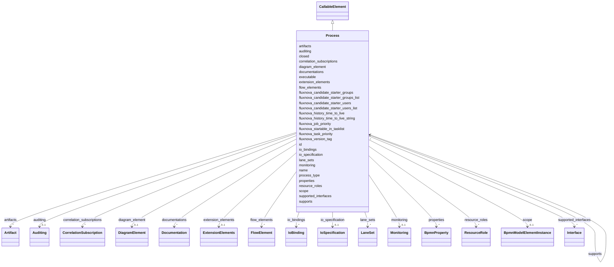

---
search:
  boost: 10.0
---

# Class: Process 


_The BPMN process element_


<div data-search-exclude markdown="1">


URI: [fluxnova_bpm_platform:Process](https://w3id.org/TD-Universe/fluxnova-bpm-platform/Process)





## Inheritance
* [BpmnModelElementInstance](BpmnModelElementInstance.md)
    * [BaseElement](BaseElement.md)
        * [RootElement](RootElement.md)
            * [CallableElement](CallableElement.md)
                * **Process**


## Slots

| Name | Cardinality and Range | Description | Inheritance |
| ---  | --- | --- | --- |
| [process_type](process_type.md) | 0..1 <br/> [String](String.md) | Whether this process is a public, private, or collaboration process | direct |
| [closed](closed.md) | 0..1 <br/> [Boolean](Boolean.md) | Whether closed | direct |
| [executable](executable.md) | 0..1 <br/> [Boolean](Boolean.md) | Whether executable | direct |
| [auditing](auditing.md) | 0..1 <br/> [Auditing](Auditing.md) | Auditing information attached to this flow element | direct |
| [monitoring](monitoring.md) | 0..1 <br/> [Monitoring](Monitoring.md) | Monitoring information attached to this flow element | direct |
| [properties](properties.md) | * <br/> [BpmnProperty](BpmnProperty.md) | Serialized properties | direct |
| [lane_sets](lane_sets.md) | * <br/> [LaneSet](LaneSet.md) | Lane sets partitioning this process into swimlanes | direct |
| [flow_elements](flow_elements.md) | * <br/> [FlowElement](FlowElement.md) | Flow elements (tasks, gateways, events, sequence flows) in this process | direct |
| [artifacts](artifacts.md) | * <br/> [Artifact](Artifact.md) | Artifacts (text annotations, groups, associations) in this process | direct |
| [correlation_subscriptions](correlation_subscriptions.md) | * <br/> [CorrelationSubscription](CorrelationSubscription.md) | Correlation subscriptions associated with this process | direct |
| [resource_roles](resource_roles.md) | * <br/> [ResourceRole](ResourceRole.md) | Resources (performers, potential owners) assigned to this activity | direct |
| [supports](supports.md) | * <br/> [Process](Process.md) | Interfaces that this process is declared to support | direct |
| [fluxnova_candidate_starter_groups](fluxnova_candidate_starter_groups.md) | 0..1 <br/> [String](String.md) | Camunda extensions | direct |
| [fluxnova_candidate_starter_groups_list](fluxnova_candidate_starter_groups_list.md) | * <br/> [String](String.md) | Fluxnova extension property: candidate starter groups list | direct |
| [fluxnova_candidate_starter_users](fluxnova_candidate_starter_users.md) | 0..1 <br/> [String](String.md) | Fluxnova extension property: candidate starter users | direct |
| [fluxnova_candidate_starter_users_list](fluxnova_candidate_starter_users_list.md) | * <br/> [String](String.md) | Fluxnova extension property: candidate starter users list | direct |
| [fluxnova_job_priority](fluxnova_job_priority.md) | 0..1 <br/> [String](String.md) | Priority assigned to async continuation jobs for this element | direct |
| [fluxnova_task_priority](fluxnova_task_priority.md) | 0..1 <br/> [String](String.md) | Fluxnova extension property: task priority | direct |
| [fluxnova_history_time_to_live](fluxnova_history_time_to_live.md) | 0..1 <br/> [Integer](Integer.md) | Fluxnova extension property: history time to live | direct |
| [fluxnova_history_time_to_live_string](fluxnova_history_time_to_live_string.md) | 0..1 <br/> [String](String.md) | Fluxnova extension property: history time to live string | direct |
| [fluxnova_startable_in_tasklist](fluxnova_startable_in_tasklist.md) | 0..1 <br/> [Boolean](Boolean.md) | Fluxnova extension property: startable in tasklist | direct |
| [fluxnova_version_tag](fluxnova_version_tag.md) | 0..1 <br/> [String](String.md) | Fluxnova extension property: version tag | direct |
| [name](name.md) | 0..1 <br/> [String](String.md) | Human-readable name | [CallableElement](CallableElement.md) |
| [supported_interfaces](supported_interfaces.md) | * <br/> [Interface](Interface.md) | Collection of interface elements associated with this element | [CallableElement](CallableElement.md) |
| [io_specification](io_specification.md) | 0..1 <br/> [IoSpecification](IoSpecification.md) | Input and output specification of this activity | [CallableElement](CallableElement.md) |
| [io_bindings](io_bindings.md) | * <br/> [IoBinding](IoBinding.md) | Collection of io binding elements associated with this element | [CallableElement](CallableElement.md) |
| [id](id.md) | 1 <br/> [String](String.md) | Unique identifier | [BaseElement](BaseElement.md) |
| [documentations](documentations.md) | * <br/> [Documentation](Documentation.md) | Collection of documentation elements associated with this element | [BaseElement](BaseElement.md) |
| [extension_elements](extension_elements.md) | 0..1 <br/> [ExtensionElements](ExtensionElements.md) | Extension elements holding vendor-specific metadata | [BaseElement](BaseElement.md) |
| [diagram_element](diagram_element.md) | 0..1 <br/> [DiagramElement](DiagramElement.md) | The diagram element that visually represents this BPMN element | [BaseElement](BaseElement.md) |
| [scope](scope.md) | 0..1 <br/> [BpmnModelElementInstance](BpmnModelElementInstance.md) | Tests if the element is a scope like process or sub-process | [BpmnModelElementInstance](BpmnModelElementInstance.md) |


## Usages

| used by | used in | type | used |
| ---  | --- | --- | --- |
| [Participant](Participant.md) | [process](process.md) | range | [Process](Process.md) |
| [Process](Process.md) | [supports](supports.md) | range | [Process](Process.md) |


## In Subsets


* [Instance](Instance.md)
* [FluxnovaBpmnModel](FluxnovaBpmnModel.md)


## Identifier and Mapping Information


### Annotations

| property | value |
| --- | --- |
| java_package | org.finos.fluxnova.bpm.model.bpmn.instance |
| source_file | model-api/bpmn-model/src/main/java/org/finos/fluxnova/bpm/model/bpmn/instance/Process.java |


### Schema Source


* from schema: https://w3id.org/TD-Universe/fluxnova-bpm-platform


## Mappings

| Mapping Type | Mapped Value |
| ---  | ---  |
| self | fluxnova_bpm_platform:Process |
| native | fluxnova_bpm_platform:Process |


## LinkML Source

<!-- TODO: investigate https://stackoverflow.com/questions/37606292/how-to-create-tabbed-code-blocks-in-mkdocs-or-sphinx -->

### Direct

<details>
```yaml
name: Process
annotations:
  java_package:
    tag: java_package
    value: org.finos.fluxnova.bpm.model.bpmn.instance
  source_file:
    tag: source_file
    value: model-api/bpmn-model/src/main/java/org/finos/fluxnova/bpm/model/bpmn/instance/Process.java
description: The BPMN process element
in_subset:
- instance
- fluxnova_bpmn_model
from_schema: https://w3id.org/TD-Universe/fluxnova-bpm-platform
is_a: CallableElement
slots:
- process_type
- closed
- executable
- auditing
- monitoring
- properties
- lane_sets
- flow_elements
- artifacts
- correlation_subscriptions
- resource_roles
- supports
- fluxnova_candidate_starter_groups
- fluxnova_candidate_starter_groups_list
- fluxnova_candidate_starter_users
- fluxnova_candidate_starter_users_list
- fluxnova_job_priority
- fluxnova_task_priority
- fluxnova_history_time_to_live
- fluxnova_history_time_to_live_string
- fluxnova_startable_in_tasklist
- fluxnova_version_tag
slot_usage:
  properties:
    name: properties
    range: BpmnProperty
    multivalued: true
    inlined_as_list: true

```
</details>

### Induced

<details>
```yaml
name: Process
annotations:
  java_package:
    tag: java_package
    value: org.finos.fluxnova.bpm.model.bpmn.instance
  source_file:
    tag: source_file
    value: model-api/bpmn-model/src/main/java/org/finos/fluxnova/bpm/model/bpmn/instance/Process.java
description: The BPMN process element
in_subset:
- instance
- fluxnova_bpmn_model
from_schema: https://w3id.org/TD-Universe/fluxnova-bpm-platform
is_a: CallableElement
slot_usage:
  properties:
    name: properties
    range: BpmnProperty
    multivalued: true
    inlined_as_list: true
attributes:
  process_type:
    name: process_type
    description: Whether this process is a public, private, or collaboration process.
    from_schema: https://w3id.org/TD-Universe/fluxnova-bpm-platform
    rank: 1000
    owner: Process
    domain_of:
    - Process
    range: string
  closed:
    name: closed
    description: Whether closed.
    from_schema: https://w3id.org/TD-Universe/fluxnova-bpm-platform
    rank: 1000
    owner: Process
    domain_of:
    - Collaboration
    - Process
    range: boolean
  executable:
    name: executable
    description: Whether executable.
    from_schema: https://w3id.org/TD-Universe/fluxnova-bpm-platform
    rank: 1000
    owner: Process
    domain_of:
    - Process
    range: boolean
  auditing:
    name: auditing
    description: Auditing information attached to this flow element.
    from_schema: https://w3id.org/TD-Universe/fluxnova-bpm-platform
    rank: 1000
    owner: Process
    domain_of:
    - FlowElement
    - Process
    range: Auditing
  monitoring:
    name: monitoring
    description: Monitoring information attached to this flow element.
    from_schema: https://w3id.org/TD-Universe/fluxnova-bpm-platform
    rank: 1000
    owner: Process
    domain_of:
    - FlowElement
    - Process
    range: Monitoring
  properties:
    name: properties
    annotations:
      sql_column:
        tag: sql_column
        value: PROPERTIES_
    description: Serialized properties.
    from_schema: https://w3id.org/TD-Universe/fluxnova-bpm-platform
    rank: 1000
    owner: Process
    domain_of:
    - Filter
    - Activity
    - Event
    - Process
    range: BpmnProperty
    multivalued: true
    inlined: true
    inlined_as_list: true
  lane_sets:
    name: lane_sets
    description: Lane sets partitioning this process into swimlanes.
    from_schema: https://w3id.org/TD-Universe/fluxnova-bpm-platform
    rank: 1000
    owner: Process
    domain_of:
    - Process
    - SubProcess
    range: LaneSet
    multivalued: true
    inlined: true
    inlined_as_list: true
  flow_elements:
    name: flow_elements
    description: Flow elements (tasks, gateways, events, sequence flows) in this process.
    from_schema: https://w3id.org/TD-Universe/fluxnova-bpm-platform
    rank: 1000
    owner: Process
    domain_of:
    - Process
    - SubProcess
    range: FlowElement
    multivalued: true
    inlined: true
    inlined_as_list: true
  artifacts:
    name: artifacts
    description: Artifacts (text annotations, groups, associations) in this process.
    from_schema: https://w3id.org/TD-Universe/fluxnova-bpm-platform
    rank: 1000
    owner: Process
    domain_of:
    - Collaboration
    - Process
    - SubProcess
    range: Artifact
    multivalued: true
    inlined: true
    inlined_as_list: true
  correlation_subscriptions:
    name: correlation_subscriptions
    description: Correlation subscriptions associated with this process.
    from_schema: https://w3id.org/TD-Universe/fluxnova-bpm-platform
    rank: 1000
    owner: Process
    domain_of:
    - Process
    range: CorrelationSubscription
    multivalued: true
    inlined: true
    inlined_as_list: true
  resource_roles:
    name: resource_roles
    description: Resources (performers, potential owners) assigned to this activity.
    from_schema: https://w3id.org/TD-Universe/fluxnova-bpm-platform
    rank: 1000
    owner: Process
    domain_of:
    - Activity
    - Process
    range: ResourceRole
    multivalued: true
    inlined: true
    inlined_as_list: true
  supports:
    name: supports
    description: Interfaces that this process is declared to support.
    from_schema: https://w3id.org/TD-Universe/fluxnova-bpm-platform
    rank: 1000
    owner: Process
    domain_of:
    - Process
    range: Process
    multivalued: true
    inlined: true
    inlined_as_list: true
  fluxnova_candidate_starter_groups:
    name: fluxnova_candidate_starter_groups
    description: Camunda extensions
    from_schema: https://w3id.org/TD-Universe/fluxnova-bpm-platform
    rank: 1000
    owner: Process
    domain_of:
    - Process
    range: string
  fluxnova_candidate_starter_groups_list:
    name: fluxnova_candidate_starter_groups_list
    description: 'Fluxnova extension property: candidate starter groups list.'
    from_schema: https://w3id.org/TD-Universe/fluxnova-bpm-platform
    rank: 1000
    owner: Process
    domain_of:
    - Process
    range: string
    multivalued: true
  fluxnova_candidate_starter_users:
    name: fluxnova_candidate_starter_users
    description: 'Fluxnova extension property: candidate starter users.'
    from_schema: https://w3id.org/TD-Universe/fluxnova-bpm-platform
    rank: 1000
    owner: Process
    domain_of:
    - Process
    range: string
  fluxnova_candidate_starter_users_list:
    name: fluxnova_candidate_starter_users_list
    description: 'Fluxnova extension property: candidate starter users list.'
    from_schema: https://w3id.org/TD-Universe/fluxnova-bpm-platform
    rank: 1000
    owner: Process
    domain_of:
    - Process
    range: string
    multivalued: true
  fluxnova_job_priority:
    name: fluxnova_job_priority
    description: Priority assigned to async continuation jobs for this element.
    from_schema: https://w3id.org/TD-Universe/fluxnova-bpm-platform
    rank: 1000
    owner: Process
    domain_of:
    - FlowNode
    - Process
    range: string
  fluxnova_task_priority:
    name: fluxnova_task_priority
    description: 'Fluxnova extension property: task priority.'
    from_schema: https://w3id.org/TD-Universe/fluxnova-bpm-platform
    rank: 1000
    owner: Process
    domain_of:
    - BusinessRuleTask
    - MessageEventDefinition
    - Process
    - SendTask
    - ServiceTask
    range: string
  fluxnova_history_time_to_live:
    name: fluxnova_history_time_to_live
    description: 'Fluxnova extension property: history time to live.'
    from_schema: https://w3id.org/TD-Universe/fluxnova-bpm-platform
    rank: 1000
    owner: Process
    domain_of:
    - Process
    range: integer
  fluxnova_history_time_to_live_string:
    name: fluxnova_history_time_to_live_string
    description: 'Fluxnova extension property: history time to live string.'
    from_schema: https://w3id.org/TD-Universe/fluxnova-bpm-platform
    rank: 1000
    owner: Process
    domain_of:
    - Process
    range: string
  fluxnova_startable_in_tasklist:
    name: fluxnova_startable_in_tasklist
    description: 'Fluxnova extension property: startable in tasklist.'
    from_schema: https://w3id.org/TD-Universe/fluxnova-bpm-platform
    rank: 1000
    owner: Process
    domain_of:
    - Process
    range: boolean
  fluxnova_version_tag:
    name: fluxnova_version_tag
    description: 'Fluxnova extension property: version tag.'
    from_schema: https://w3id.org/TD-Universe/fluxnova-bpm-platform
    rank: 1000
    owner: Process
    domain_of:
    - Process
    range: string
  name:
    name: name
    description: Human-readable name.
    from_schema: https://w3id.org/TD-Universe/fluxnova-bpm-platform
    rank: 1000
    slot_uri: schema:name
    owner: Process
    domain_of:
    - ByteArray
    - MeterLog
    - Property
    - Group
    - Tenant
    - Task
    - VariableInstance
    - Attachment
    - Filter
    - Deployment
    - ResourceDefinition
    - HistoricDetail
    - HistoricTaskInstance
    - HistoricVariableInstance
    - Font
    - Diagram
    - CallableElement
    - Category
    - Collaboration
    - ConversationLink
    - ConversationNode
    - CorrelationKey
    - CorrelationProperty
    - DataInput
    - DataOutput
    - DataState
    - DataStore
    - Definitions
    - Error
    - Escalation
    - FlowElement
    - InputSet
    - Interface
    - Lane
    - LaneSet
    - LinkEventDefinition
    - Message
    - MessageFlow
    - Operation
    - OutputSet
    - Participant
    - BpmnProperty
    - Resource
    - ResourceParameter
    - ResourceRole
    - Signal
    range: string
  supported_interfaces:
    name: supported_interfaces
    description: Collection of interface elements associated with this element.
    from_schema: https://w3id.org/TD-Universe/fluxnova-bpm-platform
    rank: 1000
    owner: Process
    domain_of:
    - CallableElement
    range: Interface
    multivalued: true
    inlined: true
    inlined_as_list: true
  io_specification:
    name: io_specification
    description: Input and output specification of this activity.
    from_schema: https://w3id.org/TD-Universe/fluxnova-bpm-platform
    rank: 1000
    owner: Process
    domain_of:
    - Activity
    - CallableElement
    range: IoSpecification
  io_bindings:
    name: io_bindings
    description: Collection of io binding elements associated with this element.
    from_schema: https://w3id.org/TD-Universe/fluxnova-bpm-platform
    rank: 1000
    owner: Process
    domain_of:
    - CallableElement
    range: IoBinding
    multivalued: true
    inlined: true
    inlined_as_list: true
  id:
    name: id
    description: Unique identifier.
    from_schema: https://w3id.org/TD-Universe/fluxnova-bpm-platform
    rank: 1000
    slot_uri: schema:identifier
    identifier: true
    owner: Process
    domain_of:
    - ByteArray
    - MeterLog
    - SchemaLogEntry
    - TaskMeterLog
    - Authorization
    - Group
    - IdentityInfo
    - IdentityLink
    - Tenant
    - TenantMembership
    - User
    - CaseExecution
    - CaseSentryPart
    - EventSubscription
    - Execution
    - ExternalTask
    - Incident
    - Task
    - VariableInstance
    - Attachment
    - Comment
    - Filter
    - Deployment
    - ResourceDefinition
    - Batch
    - Job
    - JobDefinition
    - HistoricBatch
    - HistoricDecisionInputInstance
    - HistoricDecisionInstance
    - HistoricDecisionOutputInstance
    - HistoricDetail
    - HistoricExternalTaskLog
    - HistoricIdentityLink
    - HistoricIncident
    - HistoricJobLog
    - HistoricScopeInstance
    - HistoricVariableInstance
    - UserOperationLogEntry
    - Diagram
    - DiagramElement
    - Style
    - BaseElement
    - Definitions
    - Documentation
    - InteractionNode
    range: string
    required: true
  documentations:
    name: documentations
    description: Collection of documentation elements associated with this element.
    from_schema: https://w3id.org/TD-Universe/fluxnova-bpm-platform
    rank: 1000
    owner: Process
    domain_of:
    - BaseElement
    range: Documentation
    multivalued: true
    inlined: true
    inlined_as_list: true
  extension_elements:
    name: extension_elements
    description: Extension elements holding vendor-specific metadata.
    from_schema: https://w3id.org/TD-Universe/fluxnova-bpm-platform
    rank: 1000
    owner: Process
    domain_of:
    - BaseElement
    range: ExtensionElements
  diagram_element:
    name: diagram_element
    description: The diagram element that visually represents this BPMN element.
    from_schema: https://w3id.org/TD-Universe/fluxnova-bpm-platform
    rank: 1000
    owner: Process
    domain_of:
    - BaseElement
    range: DiagramElement
  scope:
    name: scope
    description: Tests if the element is a scope like process or sub-process.
    from_schema: https://w3id.org/TD-Universe/fluxnova-bpm-platform
    rank: 1000
    owner: Process
    domain_of:
    - BpmnModelElementInstance
    range: BpmnModelElementInstance

```
</details></div>