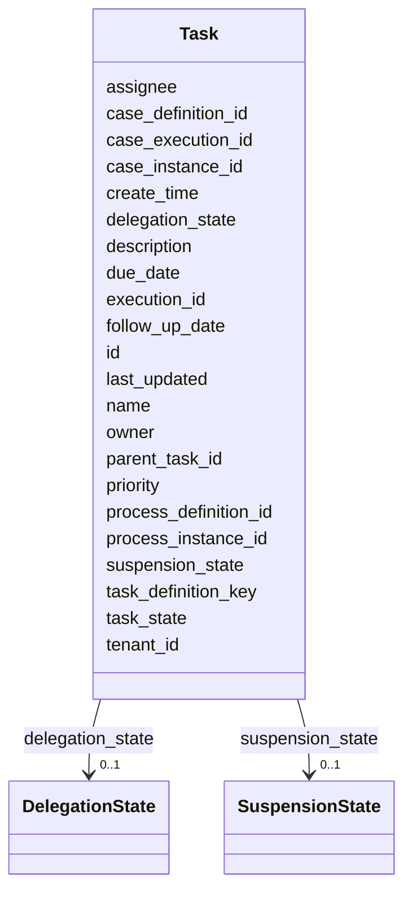

---
search:
  boost: 10.0
---

# Class: Task 


_Represents one task for a human user._


<div data-search-exclude markdown="1">


URI: [fluxnova_bpm_platform:Task](https://w3id.org/TD-Universe/fluxnova-bpm-platform/Task)





<!-- no inheritance hierarchy -->

## Slots

| Name | Cardinality and Range | Description | Inheritance |
| ---  | --- | --- | --- |
| [id](id.md) | 1 <br/> [String](String.md) | Unique identifier | direct |
| [execution_id](execution_id.md) | 0..1 <br/> [String](String.md) | Reference to the execution | direct |
| [process_instance_id](process_instance_id.md) | 0..1 <br/> [String](String.md) | Reference to the process instance | direct |
| [process_definition_id](process_definition_id.md) | 0..1 <br/> [String](String.md) | Reference to the process definition | direct |
| [case_execution_id](case_execution_id.md) | 0..1 <br/> [String](String.md) | Reference to the case execution | direct |
| [case_instance_id](case_instance_id.md) | 0..1 <br/> [String](String.md) | Reference to the case instance | direct |
| [case_definition_id](case_definition_id.md) | 0..1 <br/> [String](String.md) | Reference to the case definition | direct |
| [name](name.md) | 0..1 <br/> [String](String.md) | Human-readable name | direct |
| [parent_task_id](parent_task_id.md) | 0..1 <br/> [String](String.md) | The parent task for which this task is a subtask | direct |
| [description](description.md) | 0..1 <br/> [String](String.md) | Human-readable description | direct |
| [task_definition_key](task_definition_key.md) | 0..1 <br/> [String](String.md) | The id of the activity in the process defining this task or null if this is n... | direct |
| [owner](owner.md) | 0..1 <br/> [String](String.md) | The userId of the person that is responsible for this task | direct |
| [assignee](assignee.md) | 0..1 <br/> [String](String.md) | The userId of the person to which this task is assigned or delegated | direct |
| [delegation_state](delegation_state.md) | 0..1 <br/> [DelegationState](DelegationState.md) | The current DelegationState for this task | direct |
| [priority](priority.md) | 1 <br/> [Integer](Integer.md) | Indication of how important/urgent this task is with a number between 0 and 1... | direct |
| [create_time](create_time.md) | 0..1 <br/> [Datetime](Datetime.md) | Creation timestamp | direct |
| [last_updated](last_updated.md) | 0..1 <br/> [Datetime](Datetime.md) | The date/time when this task was last updated | direct |
| [due_date](due_date.md) | 0..1 <br/> [Datetime](Datetime.md) | Due date of the task | direct |
| [follow_up_date](follow_up_date.md) | 0..1 <br/> [Datetime](Datetime.md) | Follow-up date of the task | direct |
| [suspension_state](suspension_state.md) | 0..1 <br/> [SuspensionState](SuspensionState.md) | Whether the entity is active or suspended | direct |
| [tenant_id](tenant_id.md) | 0..1 <br/> [String](String.md) | Multi-tenancy discriminator | direct |
| [task_state](task_state.md) | 0..1 <br/> [String](String.md) | Task's state | direct |


## Usages

| used by | used in | type | used |
| ---  | --- | --- | --- |
| [FluxnovaPlatformData](FluxnovaPlatformData.md) | [tasks](tasks.md) | range | [Task](Task.md) |


## In Subsets


* [Runtime](Runtime.md)
* [FluxnovaBpm](FluxnovaBpm.md)


## Identifier and Mapping Information


### Annotations

| property | value |
| --- | --- |
| sql_table | ACT_RU_TASK |


### Schema Source


* from schema: https://w3id.org/TD-Universe/fluxnova-bpm-platform


## Mappings

| Mapping Type | Mapped Value |
| ---  | ---  |
| self | fluxnova_bpm_platform:Task |
| native | fluxnova_bpm_platform:Task |


## LinkML Source

<!-- TODO: investigate https://stackoverflow.com/questions/37606292/how-to-create-tabbed-code-blocks-in-mkdocs-or-sphinx -->

### Direct

<details>
```yaml
name: Task
annotations:
  sql_table:
    tag: sql_table
    value: ACT_RU_TASK
description: Represents one task for a human user.
in_subset:
- runtime
- fluxnova_bpm
from_schema: https://w3id.org/TD-Universe/fluxnova-bpm-platform
slots:
- id
- execution_id
- process_instance_id
- process_definition_id
- case_execution_id
- case_instance_id
- case_definition_id
- name
- parent_task_id
- description
- task_definition_key
- owner
- assignee
- delegation_state
- priority
- create_time
- last_updated
- due_date
- follow_up_date
- suspension_state
- tenant_id
- task_state

```
</details>

### Induced

<details>
```yaml
name: Task
annotations:
  sql_table:
    tag: sql_table
    value: ACT_RU_TASK
description: Represents one task for a human user.
in_subset:
- runtime
- fluxnova_bpm
from_schema: https://w3id.org/TD-Universe/fluxnova-bpm-platform
attributes:
  id:
    name: id
    description: Unique identifier.
    from_schema: https://w3id.org/TD-Universe/fluxnova-bpm-platform
    rank: 1000
    slot_uri: schema:identifier
    identifier: true
    owner: Task
    domain_of:
    - ByteArray
    - MeterLog
    - SchemaLogEntry
    - TaskMeterLog
    - Authorization
    - Group
    - IdentityInfo
    - IdentityLink
    - Tenant
    - TenantMembership
    - User
    - CaseExecution
    - CaseSentryPart
    - EventSubscription
    - Execution
    - ExternalTask
    - Incident
    - Task
    - VariableInstance
    - Attachment
    - Comment
    - Filter
    - Deployment
    - ResourceDefinition
    - Batch
    - Job
    - JobDefinition
    - HistoricBatch
    - HistoricDecisionInputInstance
    - HistoricDecisionInstance
    - HistoricDecisionOutputInstance
    - HistoricDetail
    - HistoricExternalTaskLog
    - HistoricIdentityLink
    - HistoricIncident
    - HistoricJobLog
    - HistoricScopeInstance
    - HistoricVariableInstance
    - UserOperationLogEntry
    - Diagram
    - DiagramElement
    - Style
    - BaseElement
    - Definitions
    - Documentation
    - InteractionNode
    range: string
    required: true
  execution_id:
    name: execution_id
    description: Reference to the execution.
    from_schema: https://w3id.org/TD-Universe/fluxnova-bpm-platform
    rank: 1000
    owner: Task
    domain_of:
    - EventSubscription
    - ExternalTask
    - Incident
    - Task
    - VariableInstance
    - Job
    - HistoricActivityInstance
    - HistoricDetail
    - HistoricExternalTaskLog
    - HistoricIncident
    - HistoricJobLog
    - HistoricTaskInstance
    - HistoricVariableInstance
    - UserOperationLogEntry
    range: string
  process_instance_id:
    name: process_instance_id
    description: Reference to the process instance.
    from_schema: https://w3id.org/TD-Universe/fluxnova-bpm-platform
    rank: 1000
    owner: Task
    domain_of:
    - EventSubscription
    - Execution
    - ExternalTask
    - Incident
    - Task
    - VariableInstance
    - Attachment
    - Comment
    - Job
    - HistoricDecisionInstance
    - HistoricDetail
    - HistoricExternalTaskLog
    - HistoricIncident
    - HistoricJobLog
    - HistoricScopeInstance
    - HistoricVariableInstance
    - UserOperationLogEntry
    range: string
  process_definition_id:
    name: process_definition_id
    description: Reference to the process definition.
    from_schema: https://w3id.org/TD-Universe/fluxnova-bpm-platform
    rank: 1000
    owner: Task
    domain_of:
    - IdentityLink
    - Execution
    - ExternalTask
    - Incident
    - Task
    - VariableInstance
    - Job
    - JobDefinition
    - HistoricDecisionInstance
    - HistoricDetail
    - HistoricExternalTaskLog
    - HistoricIdentityLink
    - HistoricIncident
    - HistoricJobLog
    - HistoricScopeInstance
    - HistoricVariableInstance
    - UserOperationLogEntry
    range: string
  case_execution_id:
    name: case_execution_id
    description: Reference to the case execution.
    from_schema: https://w3id.org/TD-Universe/fluxnova-bpm-platform
    rank: 1000
    owner: Task
    domain_of:
    - CaseSentryPart
    - Task
    - VariableInstance
    - HistoricDetail
    - HistoricTaskInstance
    - HistoricVariableInstance
    - UserOperationLogEntry
    range: string
  case_instance_id:
    name: case_instance_id
    description: Reference to the case instance.
    from_schema: https://w3id.org/TD-Universe/fluxnova-bpm-platform
    rank: 1000
    owner: Task
    domain_of:
    - CaseExecution
    - CaseSentryPart
    - Execution
    - Task
    - VariableInstance
    - HistoricCaseActivityInstance
    - HistoricCaseInstance
    - HistoricDecisionInstance
    - HistoricDetail
    - HistoricProcessInstance
    - HistoricTaskInstance
    - HistoricVariableInstance
    - UserOperationLogEntry
    range: string
  case_definition_id:
    name: case_definition_id
    description: Reference to the case definition.
    from_schema: https://w3id.org/TD-Universe/fluxnova-bpm-platform
    rank: 1000
    owner: Task
    domain_of:
    - CaseExecution
    - Task
    - HistoricCaseActivityInstance
    - HistoricCaseInstance
    - HistoricDecisionInstance
    - HistoricDetail
    - HistoricTaskInstance
    - HistoricVariableInstance
    - UserOperationLogEntry
    range: string
  name:
    name: name
    description: Human-readable name.
    from_schema: https://w3id.org/TD-Universe/fluxnova-bpm-platform
    rank: 1000
    slot_uri: schema:name
    owner: Task
    domain_of:
    - ByteArray
    - MeterLog
    - Property
    - Group
    - Tenant
    - Task
    - VariableInstance
    - Attachment
    - Filter
    - Deployment
    - ResourceDefinition
    - HistoricDetail
    - HistoricTaskInstance
    - HistoricVariableInstance
    - Font
    - Diagram
    - CallableElement
    - Category
    - Collaboration
    - ConversationLink
    - ConversationNode
    - CorrelationKey
    - CorrelationProperty
    - DataInput
    - DataOutput
    - DataState
    - DataStore
    - Definitions
    - Error
    - Escalation
    - FlowElement
    - InputSet
    - Interface
    - Lane
    - LaneSet
    - LinkEventDefinition
    - Message
    - MessageFlow
    - Operation
    - OutputSet
    - Participant
    - BpmnProperty
    - Resource
    - ResourceParameter
    - ResourceRole
    - Signal
    range: string
  parent_task_id:
    name: parent_task_id
    annotations:
      sql_column:
        tag: sql_column
        value: PARENT_TASK_ID_
    description: The parent task for which this task is a subtask
    from_schema: https://w3id.org/TD-Universe/fluxnova-bpm-platform
    rank: 1000
    owner: Task
    domain_of:
    - Task
    - HistoricTaskInstance
    range: string
  description:
    name: description
    description: Human-readable description.
    from_schema: https://w3id.org/TD-Universe/fluxnova-bpm-platform
    rank: 1000
    slot_uri: schema:description
    owner: Task
    domain_of:
    - Task
    - Attachment
    - HistoricTaskInstance
    range: string
  task_definition_key:
    name: task_definition_key
    annotations:
      sql_column:
        tag: sql_column
        value: TASK_DEF_KEY_
    description: The id of the activity in the process defining this task or null
      if this is not related to a process
    from_schema: https://w3id.org/TD-Universe/fluxnova-bpm-platform
    rank: 1000
    owner: Task
    domain_of:
    - Task
    - HistoricTaskInstance
    range: string
  owner:
    name: owner
    annotations:
      sql_column:
        tag: sql_column
        value: OWNER_
    description: The userId of the person that is responsible for this task. This
      is used when a task is delegated.
    from_schema: https://w3id.org/TD-Universe/fluxnova-bpm-platform
    rank: 1000
    owner: Task
    domain_of:
    - Task
    - Filter
    - HistoricTaskInstance
    range: string
  assignee:
    name: assignee
    annotations:
      sql_column:
        tag: sql_column
        value: ASSIGNEE_
    description: The userId of the person to which this task is assigned or delegated.
    from_schema: https://w3id.org/TD-Universe/fluxnova-bpm-platform
    rank: 1000
    owner: Task
    domain_of:
    - Task
    - HistoricActivityInstance
    - HistoricTaskInstance
    range: string
  delegation_state:
    name: delegation_state
    annotations:
      sql_column:
        tag: sql_column
        value: DELEGATION_
    description: The current DelegationState for this task.
    from_schema: https://w3id.org/TD-Universe/fluxnova-bpm-platform
    rank: 1000
    owner: Task
    domain_of:
    - Task
    range: DelegationState
  priority:
    name: priority
    annotations:
      sql_column:
        tag: sql_column
        value: PRIORITY_
    description: 'Indication of how important/urgent this task is with a number between
      0 and 100 where higher values mean a higher priority and lower values mean lower
      priority: [0..19] lowest, [20..39] low, [40..5...'
    from_schema: https://w3id.org/TD-Universe/fluxnova-bpm-platform
    rank: 1000
    owner: Task
    domain_of:
    - ExternalTask
    - Task
    - Job
    - HistoricExternalTaskLog
    - HistoricTaskInstance
    range: integer
    required: true
  create_time:
    name: create_time
    description: Creation timestamp.
    from_schema: https://w3id.org/TD-Universe/fluxnova-bpm-platform
    rank: 1000
    owner: Task
    domain_of:
    - ByteArray
    - ExternalTask
    - Task
    - Attachment
    - Job
    - HistoricCaseActivityInstance
    - HistoricCaseInstance
    - HistoricDecisionInputInstance
    - HistoricDecisionOutputInstance
    - HistoricIncident
    - HistoricVariableInstance
    range: datetime
  last_updated:
    name: last_updated
    annotations:
      sql_column:
        tag: sql_column
        value: LAST_UPDATED_
    description: The date/time when this task was last updated. All operations that
      fire count as an update to the task. Returns null if the task was never updated
      before (i.e. it was only created).
    from_schema: https://w3id.org/TD-Universe/fluxnova-bpm-platform
    rank: 1000
    owner: Task
    domain_of:
    - Task
    range: datetime
  due_date:
    name: due_date
    annotations:
      sql_column:
        tag: sql_column
        value: DUE_DATE_
    description: Due date of the task.
    from_schema: https://w3id.org/TD-Universe/fluxnova-bpm-platform
    rank: 1000
    owner: Task
    domain_of:
    - Task
    - Job
    - HistoricTaskInstance
    range: datetime
  follow_up_date:
    name: follow_up_date
    annotations:
      sql_column:
        tag: sql_column
        value: FOLLOW_UP_DATE_
    description: Follow-up date of the task.
    from_schema: https://w3id.org/TD-Universe/fluxnova-bpm-platform
    rank: 1000
    owner: Task
    domain_of:
    - Task
    - HistoricTaskInstance
    range: datetime
  suspension_state:
    name: suspension_state
    annotations:
      sql_column:
        tag: sql_column
        value: SUSPENSION_STATE_
    description: Whether the entity is active or suspended.
    from_schema: https://w3id.org/TD-Universe/fluxnova-bpm-platform
    rank: 1000
    owner: Task
    domain_of:
    - Execution
    - ExternalTask
    - Task
    - ProcessDefinition
    - Batch
    - Job
    - JobDefinition
    range: SuspensionState
  tenant_id:
    name: tenant_id
    description: Multi-tenancy discriminator.
    from_schema: https://w3id.org/TD-Universe/fluxnova-bpm-platform
    rank: 1000
    owner: Task
    domain_of:
    - ByteArray
    - IdentityLink
    - TenantMembership
    - CaseExecution
    - CaseSentryPart
    - EventSubscription
    - Execution
    - ExternalTask
    - Incident
    - Task
    - VariableInstance
    - Attachment
    - Comment
    - Deployment
    - ResourceDefinition
    - Batch
    - Job
    - JobDefinition
    - HistoricActivityInstance
    - HistoricBatch
    - HistoricCaseActivityInstance
    - HistoricCaseInstance
    - HistoricDecisionInputInstance
    - HistoricDecisionInstance
    - HistoricDecisionOutputInstance
    - HistoricDetail
    - HistoricExternalTaskLog
    - HistoricIdentityLink
    - HistoricIncident
    - HistoricJobLog
    - HistoricProcessInstance
    - HistoricTaskInstance
    - HistoricVariableInstance
    - UserOperationLogEntry
    range: string
  task_state:
    name: task_state
    annotations:
      sql_column:
        tag: sql_column
        value: TASK_STATE_
    description: Task's state.
    from_schema: https://w3id.org/TD-Universe/fluxnova-bpm-platform
    rank: 1000
    owner: Task
    domain_of:
    - Task
    - HistoricTaskInstance
    range: string

```
</details></div>