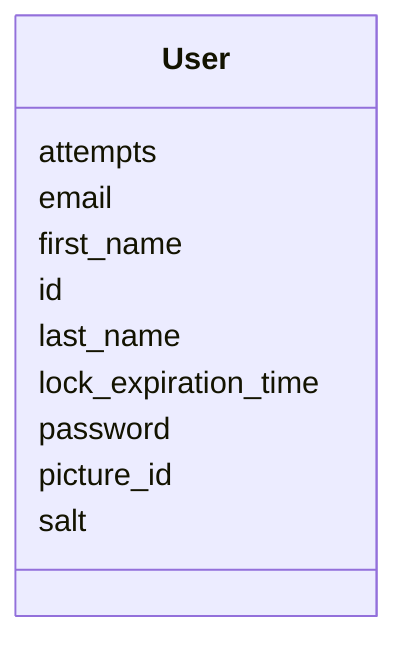

---
search:
  boost: 10.0
---

# Class: User 


_Represents a user, used in IdentityService._


<div data-search-exclude markdown="1">


URI: [fluxnova_bpm_platform:User](https://w3id.org/TD-Universe/fluxnova-bpm-platform/User)





<!-- no inheritance hierarchy -->

## Slots

| Name | Cardinality and Range | Description | Inheritance |
| ---  | --- | --- | --- |
| [id](id.md) | 1 <br/> [String](String.md) | Unique identifier | direct |
| [first_name](first_name.md) | 0..1 <br/> [String](String.md) | First name | direct |
| [last_name](last_name.md) | 0..1 <br/> [String](String.md) | Last name | direct |
| [email](email.md) | 0..1 <br/> [String](String.md) | Email address | direct |
| [password](password.md) | 0..1 <br/> [String](String.md) | Hashed password | direct |
| [salt](salt.md) | 0..1 <br/> [String](String.md) | Cryptographic salt for password hashing | direct |
| [lock_expiration_time](lock_expiration_time.md) | 0..1 <br/> [Datetime](Datetime.md) | Time at which the lock expires | direct |
| [attempts](attempts.md) | 0..1 <br/> [Integer](Integer.md) | Number of failed login attempts | direct |
| [picture_id](picture_id.md) | 0..1 <br/> [String](String.md) | Reference to the picture | direct |


## Usages

| used by | used in | type | used |
| ---  | --- | --- | --- |
| [FluxnovaPlatformData](FluxnovaPlatformData.md) | [users](users.md) | range | [User](User.md) |


## In Subsets


* [Identity](Identity.md)
* [FluxnovaBpm](FluxnovaBpm.md)


## Identifier and Mapping Information


### Annotations

| property | value |
| --- | --- |
| sql_table | ACT_ID_USER |


### Schema Source


* from schema: https://w3id.org/TD-Universe/fluxnova-bpm-platform


## Mappings

| Mapping Type | Mapped Value |
| ---  | ---  |
| self | fluxnova_bpm_platform:User |
| native | fluxnova_bpm_platform:User |


## LinkML Source

<!-- TODO: investigate https://stackoverflow.com/questions/37606292/how-to-create-tabbed-code-blocks-in-mkdocs-or-sphinx -->

### Direct

<details>
```yaml
name: User
annotations:
  sql_table:
    tag: sql_table
    value: ACT_ID_USER
description: Represents a user, used in IdentityService.
in_subset:
- identity
- fluxnova_bpm
from_schema: https://w3id.org/TD-Universe/fluxnova-bpm-platform
slots:
- id
- first_name
- last_name
- email
- password
- salt
- lock_expiration_time
- attempts
- picture_id

```
</details>

### Induced

<details>
```yaml
name: User
annotations:
  sql_table:
    tag: sql_table
    value: ACT_ID_USER
description: Represents a user, used in IdentityService.
in_subset:
- identity
- fluxnova_bpm
from_schema: https://w3id.org/TD-Universe/fluxnova-bpm-platform
attributes:
  id:
    name: id
    description: Unique identifier.
    from_schema: https://w3id.org/TD-Universe/fluxnova-bpm-platform
    rank: 1000
    slot_uri: schema:identifier
    identifier: true
    owner: User
    domain_of:
    - ByteArray
    - MeterLog
    - SchemaLogEntry
    - TaskMeterLog
    - Authorization
    - Group
    - IdentityInfo
    - IdentityLink
    - Tenant
    - TenantMembership
    - User
    - CaseExecution
    - CaseSentryPart
    - EventSubscription
    - Execution
    - ExternalTask
    - Incident
    - Task
    - VariableInstance
    - Attachment
    - Comment
    - Filter
    - Deployment
    - ResourceDefinition
    - Batch
    - Job
    - JobDefinition
    - HistoricBatch
    - HistoricDecisionInputInstance
    - HistoricDecisionInstance
    - HistoricDecisionOutputInstance
    - HistoricDetail
    - HistoricExternalTaskLog
    - HistoricIdentityLink
    - HistoricIncident
    - HistoricJobLog
    - HistoricScopeInstance
    - HistoricVariableInstance
    - UserOperationLogEntry
    - Diagram
    - DiagramElement
    - Style
    - BaseElement
    - Definitions
    - Documentation
    - InteractionNode
    range: string
    required: true
  first_name:
    name: first_name
    annotations:
      sql_column:
        tag: sql_column
        value: FIRST_
    description: First name.
    from_schema: https://w3id.org/TD-Universe/fluxnova-bpm-platform
    rank: 1000
    owner: User
    domain_of:
    - User
    range: string
  last_name:
    name: last_name
    annotations:
      sql_column:
        tag: sql_column
        value: LAST_
    description: Last name.
    from_schema: https://w3id.org/TD-Universe/fluxnova-bpm-platform
    rank: 1000
    owner: User
    domain_of:
    - User
    range: string
  email:
    name: email
    annotations:
      sql_column:
        tag: sql_column
        value: EMAIL_
    description: Email address.
    from_schema: https://w3id.org/TD-Universe/fluxnova-bpm-platform
    rank: 1000
    owner: User
    domain_of:
    - User
    range: string
  password:
    name: password
    annotations:
      sql_column:
        tag: sql_column
        value: PASSWORD_
    description: Hashed password.
    from_schema: https://w3id.org/TD-Universe/fluxnova-bpm-platform
    rank: 1000
    owner: User
    domain_of:
    - IdentityInfo
    - User
    range: string
  salt:
    name: salt
    annotations:
      sql_column:
        tag: sql_column
        value: SALT_
    description: Cryptographic salt for password hashing.
    from_schema: https://w3id.org/TD-Universe/fluxnova-bpm-platform
    rank: 1000
    owner: User
    domain_of:
    - User
    range: string
  lock_expiration_time:
    name: lock_expiration_time
    annotations:
      sql_column:
        tag: sql_column
        value: LOCK_EXP_TIME_
    description: Time at which the lock expires.
    from_schema: https://w3id.org/TD-Universe/fluxnova-bpm-platform
    rank: 1000
    owner: User
    domain_of:
    - User
    - ExternalTask
    - Job
    range: datetime
  attempts:
    name: attempts
    annotations:
      sql_column:
        tag: sql_column
        value: ATTEMPTS_
    description: Number of failed login attempts.
    from_schema: https://w3id.org/TD-Universe/fluxnova-bpm-platform
    rank: 1000
    owner: User
    domain_of:
    - User
    range: integer
  picture_id:
    name: picture_id
    annotations:
      sql_column:
        tag: sql_column
        value: PICTURE_ID_
    description: Reference to the picture.
    from_schema: https://w3id.org/TD-Universe/fluxnova-bpm-platform
    rank: 1000
    owner: User
    domain_of:
    - User
    range: string

```
</details></div>