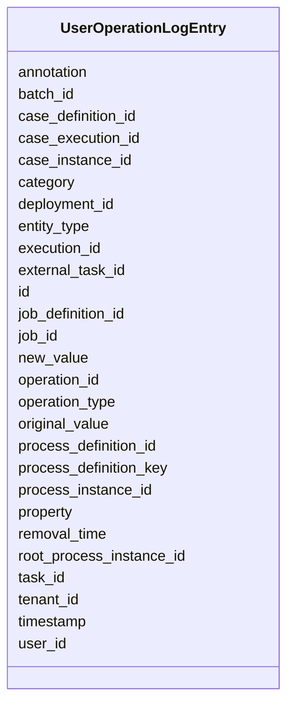

---
search:
  boost: 10.0
---

# Class: UserOperationLogEntry 


_Log entry about an operation performed by a user. This is used for logging actions such as creating a new task, completing a task, canceling a process instance, ... The type of the operation which ..._


<div data-search-exclude markdown="1">


URI: [fluxnova_bpm_platform:UserOperationLogEntry](https://w3id.org/TD-Universe/fluxnova-bpm-platform/UserOperationLogEntry)





<!-- no inheritance hierarchy -->

## Slots

| Name | Cardinality and Range | Description | Inheritance |
| ---  | --- | --- | --- |
| [id](id.md) | 1 <br/> [String](String.md) | Unique identifier | direct |
| [deployment_id](deployment_id.md) | 0..1 <br/> [String](String.md) | Reference to the deployment | direct |
| [process_definition_id](process_definition_id.md) | 0..1 <br/> [String](String.md) | Reference to the process definition | direct |
| [process_definition_key](process_definition_key.md) | 0..1 <br/> [String](String.md) | Key of the process definition | direct |
| [root_process_instance_id](root_process_instance_id.md) | 0..1 <br/> [String](String.md) | Root process instance for history cleanup | direct |
| [process_instance_id](process_instance_id.md) | 0..1 <br/> [String](String.md) | Reference to the process instance | direct |
| [execution_id](execution_id.md) | 0..1 <br/> [String](String.md) | Reference to the execution | direct |
| [case_definition_id](case_definition_id.md) | 0..1 <br/> [String](String.md) | Reference to the case definition | direct |
| [case_instance_id](case_instance_id.md) | 0..1 <br/> [String](String.md) | Reference to the case instance | direct |
| [case_execution_id](case_execution_id.md) | 0..1 <br/> [String](String.md) | Reference to the case execution | direct |
| [task_id](task_id.md) | 0..1 <br/> [String](String.md) | Reference to the task | direct |
| [job_id](job_id.md) | 1 <br/> [String](String.md) | Id of the associated job | direct |
| [job_definition_id](job_definition_id.md) | 0..1 <br/> [String](String.md) | Reference to the job definition | direct |
| [batch_id](batch_id.md) | 0..1 <br/> [String](String.md) | Reference to a batch | direct |
| [user_id](user_id.md) | 0..1 <br/> [String](String.md) | Reference to a user | direct |
| [timestamp](timestamp.md) | 1 <br/> [Datetime](Datetime.md) | Time when this log occurred | direct |
| [operation_type](operation_type.md) | 0..1 <br/> [String](String.md) | Type of identity link history (add or delete identity link) | direct |
| [operation_id](operation_id.md) | 0..1 <br/> [String](String.md) | The unique identifier of this operation | direct |
| [entity_type](entity_type.md) | 0..1 <br/> [String](String.md) | The type of the entity on which this operation was executed | direct |
| [property](property.md) | 0..1 <br/> [String](String.md) | The property changed by this operation | direct |
| [original_value](original_value.md) | 0..1 <br/> [String](String.md) | The original value | direct |
| [new_value](new_value.md) | 0..1 <br/> [String](String.md) | The new value of the property | direct |
| [tenant_id](tenant_id.md) | 0..1 <br/> [String](String.md) | Multi-tenancy discriminator | direct |
| [removal_time](removal_time.md) | 0..1 <br/> [Datetime](Datetime.md) | Timestamp when this entity is eligible for removal | direct |
| [category](category.md) | 0..1 <br/> [String](String.md) | Category classification | direct |
| [external_task_id](external_task_id.md) | 1 <br/> [String](String.md) | Id of the associated external task | direct |
| [annotation](annotation.md) | 0..1 <br/> [String](String.md) | Annotation of this incident | direct |


## In Subsets


* [History](History.md)
* [FluxnovaBpm](FluxnovaBpm.md)


## Identifier and Mapping Information


### Annotations

| property | value |
| --- | --- |
| sql_table | ACT_HI_OP_LOG |


### Schema Source


* from schema: https://w3id.org/TD-Universe/fluxnova-bpm-platform


## Mappings

| Mapping Type | Mapped Value |
| ---  | ---  |
| self | fluxnova_bpm_platform:UserOperationLogEntry |
| native | fluxnova_bpm_platform:UserOperationLogEntry |


## LinkML Source

<!-- TODO: investigate https://stackoverflow.com/questions/37606292/how-to-create-tabbed-code-blocks-in-mkdocs-or-sphinx -->

### Direct

<details>
```yaml
name: UserOperationLogEntry
annotations:
  sql_table:
    tag: sql_table
    value: ACT_HI_OP_LOG
description: Log entry about an operation performed by a user. This is used for logging
  actions such as creating a new task, completing a task, canceling a process instance,
  ... The type of the operation which ...
in_subset:
- history
- fluxnova_bpm
from_schema: https://w3id.org/TD-Universe/fluxnova-bpm-platform
slots:
- id
- deployment_id
- process_definition_id
- process_definition_key
- root_process_instance_id
- process_instance_id
- execution_id
- case_definition_id
- case_instance_id
- case_execution_id
- task_id
- job_id
- job_definition_id
- batch_id
- user_id
- timestamp
- operation_type
- operation_id
- entity_type
- property
- original_value
- new_value
- tenant_id
- removal_time
- category
- external_task_id
- annotation
slot_usage:
  timestamp:
    name: timestamp
    required: true

```
</details>

### Induced

<details>
```yaml
name: UserOperationLogEntry
annotations:
  sql_table:
    tag: sql_table
    value: ACT_HI_OP_LOG
description: Log entry about an operation performed by a user. This is used for logging
  actions such as creating a new task, completing a task, canceling a process instance,
  ... The type of the operation which ...
in_subset:
- history
- fluxnova_bpm
from_schema: https://w3id.org/TD-Universe/fluxnova-bpm-platform
slot_usage:
  timestamp:
    name: timestamp
    required: true
attributes:
  id:
    name: id
    description: Unique identifier.
    from_schema: https://w3id.org/TD-Universe/fluxnova-bpm-platform
    rank: 1000
    slot_uri: schema:identifier
    identifier: true
    owner: UserOperationLogEntry
    domain_of:
    - ByteArray
    - MeterLog
    - SchemaLogEntry
    - TaskMeterLog
    - Authorization
    - Group
    - IdentityInfo
    - IdentityLink
    - Tenant
    - TenantMembership
    - User
    - CaseExecution
    - CaseSentryPart
    - EventSubscription
    - Execution
    - ExternalTask
    - Incident
    - Task
    - VariableInstance
    - Attachment
    - Comment
    - Filter
    - Deployment
    - ResourceDefinition
    - Batch
    - Job
    - JobDefinition
    - HistoricBatch
    - HistoricDecisionInputInstance
    - HistoricDecisionInstance
    - HistoricDecisionOutputInstance
    - HistoricDetail
    - HistoricExternalTaskLog
    - HistoricIdentityLink
    - HistoricIncident
    - HistoricJobLog
    - HistoricScopeInstance
    - HistoricVariableInstance
    - UserOperationLogEntry
    - Diagram
    - DiagramElement
    - Style
    - BaseElement
    - Definitions
    - Documentation
    - InteractionNode
    range: string
    required: true
  deployment_id:
    name: deployment_id
    description: Reference to the deployment.
    from_schema: https://w3id.org/TD-Universe/fluxnova-bpm-platform
    rank: 1000
    owner: UserOperationLogEntry
    domain_of:
    - ByteArray
    - ResourceDefinition
    - Job
    - JobDefinition
    - HistoricJobLog
    - UserOperationLogEntry
    range: string
  process_definition_id:
    name: process_definition_id
    description: Reference to the process definition.
    from_schema: https://w3id.org/TD-Universe/fluxnova-bpm-platform
    rank: 1000
    owner: UserOperationLogEntry
    domain_of:
    - IdentityLink
    - Execution
    - ExternalTask
    - Incident
    - Task
    - VariableInstance
    - Job
    - JobDefinition
    - HistoricDecisionInstance
    - HistoricDetail
    - HistoricExternalTaskLog
    - HistoricIdentityLink
    - HistoricIncident
    - HistoricJobLog
    - HistoricScopeInstance
    - HistoricVariableInstance
    - UserOperationLogEntry
    range: string
  process_definition_key:
    name: process_definition_key
    description: Key of the process definition.
    from_schema: https://w3id.org/TD-Universe/fluxnova-bpm-platform
    rank: 1000
    owner: UserOperationLogEntry
    domain_of:
    - Execution
    - ExternalTask
    - Job
    - JobDefinition
    - HistoricDecisionInstance
    - HistoricDetail
    - HistoricExternalTaskLog
    - HistoricIdentityLink
    - HistoricIncident
    - HistoricJobLog
    - HistoricScopeInstance
    - HistoricVariableInstance
    - UserOperationLogEntry
    range: string
  root_process_instance_id:
    name: root_process_instance_id
    description: Root process instance for history cleanup.
    from_schema: https://w3id.org/TD-Universe/fluxnova-bpm-platform
    rank: 1000
    owner: UserOperationLogEntry
    domain_of:
    - ByteArray
    - Authorization
    - Execution
    - Attachment
    - Comment
    - Job
    - HistoricDecisionInputInstance
    - HistoricDecisionInstance
    - HistoricDecisionOutputInstance
    - HistoricDetail
    - HistoricExternalTaskLog
    - HistoricIdentityLink
    - HistoricIncident
    - HistoricJobLog
    - HistoricScopeInstance
    - HistoricVariableInstance
    - UserOperationLogEntry
    range: string
  process_instance_id:
    name: process_instance_id
    description: Reference to the process instance.
    from_schema: https://w3id.org/TD-Universe/fluxnova-bpm-platform
    rank: 1000
    owner: UserOperationLogEntry
    domain_of:
    - EventSubscription
    - Execution
    - ExternalTask
    - Incident
    - Task
    - VariableInstance
    - Attachment
    - Comment
    - Job
    - HistoricDecisionInstance
    - HistoricDetail
    - HistoricExternalTaskLog
    - HistoricIncident
    - HistoricJobLog
    - HistoricScopeInstance
    - HistoricVariableInstance
    - UserOperationLogEntry
    range: string
  execution_id:
    name: execution_id
    description: Reference to the execution.
    from_schema: https://w3id.org/TD-Universe/fluxnova-bpm-platform
    rank: 1000
    owner: UserOperationLogEntry
    domain_of:
    - EventSubscription
    - ExternalTask
    - Incident
    - Task
    - VariableInstance
    - Job
    - HistoricActivityInstance
    - HistoricDetail
    - HistoricExternalTaskLog
    - HistoricIncident
    - HistoricJobLog
    - HistoricTaskInstance
    - HistoricVariableInstance
    - UserOperationLogEntry
    range: string
  case_definition_id:
    name: case_definition_id
    description: Reference to the case definition.
    from_schema: https://w3id.org/TD-Universe/fluxnova-bpm-platform
    rank: 1000
    owner: UserOperationLogEntry
    domain_of:
    - CaseExecution
    - Task
    - HistoricCaseActivityInstance
    - HistoricCaseInstance
    - HistoricDecisionInstance
    - HistoricDetail
    - HistoricTaskInstance
    - HistoricVariableInstance
    - UserOperationLogEntry
    range: string
  case_instance_id:
    name: case_instance_id
    description: Reference to the case instance.
    from_schema: https://w3id.org/TD-Universe/fluxnova-bpm-platform
    rank: 1000
    owner: UserOperationLogEntry
    domain_of:
    - CaseExecution
    - CaseSentryPart
    - Execution
    - Task
    - VariableInstance
    - HistoricCaseActivityInstance
    - HistoricCaseInstance
    - HistoricDecisionInstance
    - HistoricDetail
    - HistoricProcessInstance
    - HistoricTaskInstance
    - HistoricVariableInstance
    - UserOperationLogEntry
    range: string
  case_execution_id:
    name: case_execution_id
    description: Reference to the case execution.
    from_schema: https://w3id.org/TD-Universe/fluxnova-bpm-platform
    rank: 1000
    owner: UserOperationLogEntry
    domain_of:
    - CaseSentryPart
    - Task
    - VariableInstance
    - HistoricDetail
    - HistoricTaskInstance
    - HistoricVariableInstance
    - UserOperationLogEntry
    range: string
  task_id:
    name: task_id
    description: Reference to the task.
    from_schema: https://w3id.org/TD-Universe/fluxnova-bpm-platform
    rank: 1000
    owner: UserOperationLogEntry
    domain_of:
    - IdentityLink
    - VariableInstance
    - Attachment
    - Comment
    - HistoricActivityInstance
    - HistoricCaseActivityInstance
    - HistoricDetail
    - HistoricIdentityLink
    - HistoricVariableInstance
    - UserOperationLogEntry
    range: string
  job_id:
    name: job_id
    annotations:
      sql_column:
        tag: sql_column
        value: JOB_ID_
    description: Id of the associated job.
    from_schema: https://w3id.org/TD-Universe/fluxnova-bpm-platform
    rank: 1000
    owner: UserOperationLogEntry
    domain_of:
    - HistoricJobLog
    - UserOperationLogEntry
    range: string
    required: true
  job_definition_id:
    name: job_definition_id
    description: Reference to the job definition.
    from_schema: https://w3id.org/TD-Universe/fluxnova-bpm-platform
    rank: 1000
    owner: UserOperationLogEntry
    domain_of:
    - Incident
    - Job
    - HistoricIncident
    - HistoricJobLog
    - UserOperationLogEntry
    range: string
  batch_id:
    name: batch_id
    description: Reference to a batch.
    from_schema: https://w3id.org/TD-Universe/fluxnova-bpm-platform
    rank: 1000
    owner: UserOperationLogEntry
    domain_of:
    - VariableInstance
    - Job
    - HistoricJobLog
    - UserOperationLogEntry
    range: string
  user_id:
    name: user_id
    description: Reference to a user.
    from_schema: https://w3id.org/TD-Universe/fluxnova-bpm-platform
    rank: 1000
    owner: UserOperationLogEntry
    domain_of:
    - Authorization
    - IdentityInfo
    - IdentityLink
    - Membership
    - TenantMembership
    - Attachment
    - Comment
    - HistoricDecisionInstance
    - HistoricIdentityLink
    - UserOperationLogEntry
    range: string
  timestamp:
    name: timestamp
    annotations:
      sql_column:
        tag: sql_column
        value: TIMESTAMP_
    description: Time when this log occurred.
    from_schema: https://w3id.org/TD-Universe/fluxnova-bpm-platform
    rank: 1000
    owner: UserOperationLogEntry
    domain_of:
    - MeterLog
    - SchemaLogEntry
    - TaskMeterLog
    - HistoricExternalTaskLog
    - HistoricIdentityLink
    - HistoricJobLog
    - UserOperationLogEntry
    range: datetime
    required: true
  operation_type:
    name: operation_type
    annotations:
      sql_column:
        tag: sql_column
        value: OPERATION_TYPE_
    description: Type of identity link history (add or delete identity link)
    from_schema: https://w3id.org/TD-Universe/fluxnova-bpm-platform
    rank: 1000
    owner: UserOperationLogEntry
    domain_of:
    - HistoricIdentityLink
    - UserOperationLogEntry
    range: string
  operation_id:
    name: operation_id
    annotations:
      sql_column:
        tag: sql_column
        value: OPERATION_ID_
    description: The unique identifier of this operation. If an operation modifies
      multiple properties, multiple UserOperationLogEntry instances will be created
      with a common operationId. This allows grouping multi...
    from_schema: https://w3id.org/TD-Universe/fluxnova-bpm-platform
    rank: 1000
    owner: UserOperationLogEntry
    domain_of:
    - HistoricDetail
    - UserOperationLogEntry
    range: string
  entity_type:
    name: entity_type
    annotations:
      sql_column:
        tag: sql_column
        value: ENTITY_TYPE_
    description: The type of the entity on which this operation was executed.
    from_schema: https://w3id.org/TD-Universe/fluxnova-bpm-platform
    rank: 1000
    owner: UserOperationLogEntry
    domain_of:
    - UserOperationLogEntry
    range: string
  property:
    name: property
    annotations:
      sql_column:
        tag: sql_column
        value: PROPERTY_
    description: The property changed by this operation.
    from_schema: https://w3id.org/TD-Universe/fluxnova-bpm-platform
    rank: 1000
    owner: UserOperationLogEntry
    domain_of:
    - UserOperationLogEntry
    range: string
  original_value:
    name: original_value
    annotations:
      sql_column:
        tag: sql_column
        value: ORG_VALUE_
    description: The original value.
    from_schema: https://w3id.org/TD-Universe/fluxnova-bpm-platform
    rank: 1000
    owner: UserOperationLogEntry
    domain_of:
    - UserOperationLogEntry
    range: string
  new_value:
    name: new_value
    annotations:
      sql_column:
        tag: sql_column
        value: NEW_VALUE_
    description: The new value of the property.
    from_schema: https://w3id.org/TD-Universe/fluxnova-bpm-platform
    rank: 1000
    owner: UserOperationLogEntry
    domain_of:
    - UserOperationLogEntry
    range: string
  tenant_id:
    name: tenant_id
    description: Multi-tenancy discriminator.
    from_schema: https://w3id.org/TD-Universe/fluxnova-bpm-platform
    rank: 1000
    owner: UserOperationLogEntry
    domain_of:
    - ByteArray
    - IdentityLink
    - TenantMembership
    - CaseExecution
    - CaseSentryPart
    - EventSubscription
    - Execution
    - ExternalTask
    - Incident
    - Task
    - VariableInstance
    - Attachment
    - Comment
    - Deployment
    - ResourceDefinition
    - Batch
    - Job
    - JobDefinition
    - HistoricActivityInstance
    - HistoricBatch
    - HistoricCaseActivityInstance
    - HistoricCaseInstance
    - HistoricDecisionInputInstance
    - HistoricDecisionInstance
    - HistoricDecisionOutputInstance
    - HistoricDetail
    - HistoricExternalTaskLog
    - HistoricIdentityLink
    - HistoricIncident
    - HistoricJobLog
    - HistoricProcessInstance
    - HistoricTaskInstance
    - HistoricVariableInstance
    - UserOperationLogEntry
    range: string
  removal_time:
    name: removal_time
    description: Timestamp when this entity is eligible for removal.
    from_schema: https://w3id.org/TD-Universe/fluxnova-bpm-platform
    rank: 1000
    owner: UserOperationLogEntry
    domain_of:
    - ByteArray
    - Authorization
    - Attachment
    - Comment
    - HistoricBatch
    - HistoricDecisionInputInstance
    - HistoricDecisionInstance
    - HistoricDecisionOutputInstance
    - HistoricDetail
    - HistoricExternalTaskLog
    - HistoricIdentityLink
    - HistoricIncident
    - HistoricJobLog
    - HistoricScopeInstance
    - HistoricVariableInstance
    - UserOperationLogEntry
    range: datetime
  category:
    name: category
    description: Category classification.
    from_schema: https://w3id.org/TD-Universe/fluxnova-bpm-platform
    rank: 1000
    owner: UserOperationLogEntry
    domain_of:
    - ResourceDefinition
    - UserOperationLogEntry
    - BpmnGroup
    range: string
  external_task_id:
    name: external_task_id
    annotations:
      sql_column:
        tag: sql_column
        value: EXT_TASK_ID_
    description: Id of the associated external task.
    from_schema: https://w3id.org/TD-Universe/fluxnova-bpm-platform
    rank: 1000
    owner: UserOperationLogEntry
    domain_of:
    - HistoricExternalTaskLog
    - UserOperationLogEntry
    range: string
    required: true
  annotation:
    name: annotation
    annotations:
      sql_column:
        tag: sql_column
        value: ANNOTATION_
    description: Annotation of this incident
    from_schema: https://w3id.org/TD-Universe/fluxnova-bpm-platform
    rank: 1000
    owner: UserOperationLogEntry
    domain_of:
    - Incident
    - HistoricIncident
    - UserOperationLogEntry
    range: string

```
</details></div>