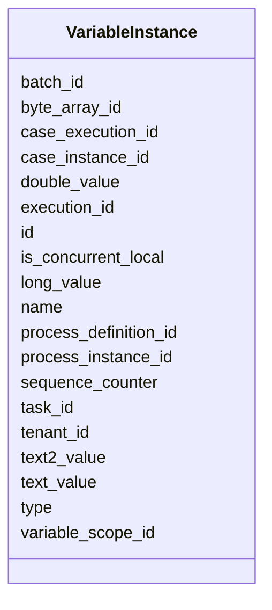

---
search:
  boost: 10.0
---

# Class: VariableInstance 


_A VariableInstance represents a variable in the execution of a process instance._


<div data-search-exclude markdown="1">


URI: [fluxnova_bpm_platform:VariableInstance](https://w3id.org/TD-Universe/fluxnova-bpm-platform/VariableInstance)





<!-- no inheritance hierarchy -->

## Slots

| Name | Cardinality and Range | Description | Inheritance |
| ---  | --- | --- | --- |
| [id](id.md) | 1 <br/> [String](String.md) | Unique identifier | direct |
| [type](type.md) | 1 <br/> [String](String.md) | Type discriminator | direct |
| [name](name.md) | 1 <br/> [String](String.md) | Human-readable name | direct |
| [execution_id](execution_id.md) | 0..1 <br/> [String](String.md) | Reference to the execution | direct |
| [process_instance_id](process_instance_id.md) | 0..1 <br/> [String](String.md) | Reference to the process instance | direct |
| [process_definition_id](process_definition_id.md) | 0..1 <br/> [String](String.md) | Reference to the process definition | direct |
| [case_execution_id](case_execution_id.md) | 0..1 <br/> [String](String.md) | Reference to the case execution | direct |
| [case_instance_id](case_instance_id.md) | 0..1 <br/> [String](String.md) | Reference to the case instance | direct |
| [task_id](task_id.md) | 0..1 <br/> [String](String.md) | Reference to the task | direct |
| [batch_id](batch_id.md) | 0..1 <br/> [String](String.md) | Reference to a batch | direct |
| [byte_array_id](byte_array_id.md) | 0..1 <br/> [String](String.md) | Reference to the byte array | direct |
| [double_value](double_value.md) | 0..1 <br/> [Float](Float.md) | Variable value stored as double | direct |
| [long_value](long_value.md) | 0..1 <br/> [Integer](Integer.md) | Variable value stored as long | direct |
| [text_value](text_value.md) | 0..1 <br/> [String](String.md) | Variable value stored as text | direct |
| [text2_value](text2_value.md) | 0..1 <br/> [String](String.md) | Variable value stored as text2 | direct |
| [variable_scope_id](variable_scope_id.md) | 1 <br/> [String](String.md) | Reference to the variable scope | direct |
| [sequence_counter](sequence_counter.md) | 0..1 <br/> [Integer](Integer.md) | Monotonically increasing counter for ordering | direct |
| [is_concurrent_local](is_concurrent_local.md) | 0..1 <br/> [Boolean](Boolean.md) | Whether this entity is concurrent local | direct |
| [tenant_id](tenant_id.md) | 0..1 <br/> [String](String.md) | Multi-tenancy discriminator | direct |


## In Subsets


* [Runtime](Runtime.md)
* [FluxnovaBpm](FluxnovaBpm.md)


## Identifier and Mapping Information


### Annotations

| property | value |
| --- | --- |
| sql_table | ACT_RU_VARIABLE |


### Schema Source


* from schema: https://w3id.org/TD-Universe/fluxnova-bpm-platform


## Mappings

| Mapping Type | Mapped Value |
| ---  | ---  |
| self | fluxnova_bpm_platform:VariableInstance |
| native | fluxnova_bpm_platform:VariableInstance |


## LinkML Source

<!-- TODO: investigate https://stackoverflow.com/questions/37606292/how-to-create-tabbed-code-blocks-in-mkdocs-or-sphinx -->

### Direct

<details>
```yaml
name: VariableInstance
annotations:
  sql_table:
    tag: sql_table
    value: ACT_RU_VARIABLE
description: A VariableInstance represents a variable in the execution of a process
  instance.
in_subset:
- runtime
- fluxnova_bpm
from_schema: https://w3id.org/TD-Universe/fluxnova-bpm-platform
slots:
- id
- type
- name
- execution_id
- process_instance_id
- process_definition_id
- case_execution_id
- case_instance_id
- task_id
- batch_id
- byte_array_id
- double_value
- long_value
- text_value
- text2_value
- variable_scope_id
- sequence_counter
- is_concurrent_local
- tenant_id
slot_usage:
  type:
    name: type
    required: true
  name:
    name: name
    required: true

```
</details>

### Induced

<details>
```yaml
name: VariableInstance
annotations:
  sql_table:
    tag: sql_table
    value: ACT_RU_VARIABLE
description: A VariableInstance represents a variable in the execution of a process
  instance.
in_subset:
- runtime
- fluxnova_bpm
from_schema: https://w3id.org/TD-Universe/fluxnova-bpm-platform
slot_usage:
  type:
    name: type
    required: true
  name:
    name: name
    required: true
attributes:
  id:
    name: id
    description: Unique identifier.
    from_schema: https://w3id.org/TD-Universe/fluxnova-bpm-platform
    rank: 1000
    slot_uri: schema:identifier
    identifier: true
    owner: VariableInstance
    domain_of:
    - ByteArray
    - MeterLog
    - SchemaLogEntry
    - TaskMeterLog
    - Authorization
    - Group
    - IdentityInfo
    - IdentityLink
    - Tenant
    - TenantMembership
    - User
    - CaseExecution
    - CaseSentryPart
    - EventSubscription
    - Execution
    - ExternalTask
    - Incident
    - Task
    - VariableInstance
    - Attachment
    - Comment
    - Filter
    - Deployment
    - ResourceDefinition
    - Batch
    - Job
    - JobDefinition
    - HistoricBatch
    - HistoricDecisionInputInstance
    - HistoricDecisionInstance
    - HistoricDecisionOutputInstance
    - HistoricDetail
    - HistoricExternalTaskLog
    - HistoricIdentityLink
    - HistoricIncident
    - HistoricJobLog
    - HistoricScopeInstance
    - HistoricVariableInstance
    - UserOperationLogEntry
    - Diagram
    - DiagramElement
    - Style
    - BaseElement
    - Definitions
    - Documentation
    - InteractionNode
    range: string
    required: true
  type:
    name: type
    description: Type discriminator.
    from_schema: https://w3id.org/TD-Universe/fluxnova-bpm-platform
    rank: 1000
    owner: VariableInstance
    domain_of:
    - ByteArray
    - Authorization
    - Group
    - IdentityInfo
    - IdentityLink
    - CaseSentryPart
    - VariableInstance
    - Attachment
    - Comment
    - Batch
    - Job
    - HistoricBatch
    - HistoricDetail
    - HistoricIdentityLink
    - ConditionExpression
    - CorrelationProperty
    - Relationship
    - ResourceParameter
    range: string
    required: true
  name:
    name: name
    description: Human-readable name.
    from_schema: https://w3id.org/TD-Universe/fluxnova-bpm-platform
    rank: 1000
    slot_uri: schema:name
    owner: VariableInstance
    domain_of:
    - ByteArray
    - MeterLog
    - Property
    - Group
    - Tenant
    - Task
    - VariableInstance
    - Attachment
    - Filter
    - Deployment
    - ResourceDefinition
    - HistoricDetail
    - HistoricTaskInstance
    - HistoricVariableInstance
    - Font
    - Diagram
    - CallableElement
    - Category
    - Collaboration
    - ConversationLink
    - ConversationNode
    - CorrelationKey
    - CorrelationProperty
    - DataInput
    - DataOutput
    - DataState
    - DataStore
    - Definitions
    - Error
    - Escalation
    - FlowElement
    - InputSet
    - Interface
    - Lane
    - LaneSet
    - LinkEventDefinition
    - Message
    - MessageFlow
    - Operation
    - OutputSet
    - Participant
    - BpmnProperty
    - Resource
    - ResourceParameter
    - ResourceRole
    - Signal
    range: string
    required: true
  execution_id:
    name: execution_id
    description: Reference to the execution.
    from_schema: https://w3id.org/TD-Universe/fluxnova-bpm-platform
    rank: 1000
    owner: VariableInstance
    domain_of:
    - EventSubscription
    - ExternalTask
    - Incident
    - Task
    - VariableInstance
    - Job
    - HistoricActivityInstance
    - HistoricDetail
    - HistoricExternalTaskLog
    - HistoricIncident
    - HistoricJobLog
    - HistoricTaskInstance
    - HistoricVariableInstance
    - UserOperationLogEntry
    range: string
  process_instance_id:
    name: process_instance_id
    description: Reference to the process instance.
    from_schema: https://w3id.org/TD-Universe/fluxnova-bpm-platform
    rank: 1000
    owner: VariableInstance
    domain_of:
    - EventSubscription
    - Execution
    - ExternalTask
    - Incident
    - Task
    - VariableInstance
    - Attachment
    - Comment
    - Job
    - HistoricDecisionInstance
    - HistoricDetail
    - HistoricExternalTaskLog
    - HistoricIncident
    - HistoricJobLog
    - HistoricScopeInstance
    - HistoricVariableInstance
    - UserOperationLogEntry
    range: string
  process_definition_id:
    name: process_definition_id
    description: Reference to the process definition.
    from_schema: https://w3id.org/TD-Universe/fluxnova-bpm-platform
    rank: 1000
    owner: VariableInstance
    domain_of:
    - IdentityLink
    - Execution
    - ExternalTask
    - Incident
    - Task
    - VariableInstance
    - Job
    - JobDefinition
    - HistoricDecisionInstance
    - HistoricDetail
    - HistoricExternalTaskLog
    - HistoricIdentityLink
    - HistoricIncident
    - HistoricJobLog
    - HistoricScopeInstance
    - HistoricVariableInstance
    - UserOperationLogEntry
    range: string
  case_execution_id:
    name: case_execution_id
    description: Reference to the case execution.
    from_schema: https://w3id.org/TD-Universe/fluxnova-bpm-platform
    rank: 1000
    owner: VariableInstance
    domain_of:
    - CaseSentryPart
    - Task
    - VariableInstance
    - HistoricDetail
    - HistoricTaskInstance
    - HistoricVariableInstance
    - UserOperationLogEntry
    range: string
  case_instance_id:
    name: case_instance_id
    description: Reference to the case instance.
    from_schema: https://w3id.org/TD-Universe/fluxnova-bpm-platform
    rank: 1000
    owner: VariableInstance
    domain_of:
    - CaseExecution
    - CaseSentryPart
    - Execution
    - Task
    - VariableInstance
    - HistoricCaseActivityInstance
    - HistoricCaseInstance
    - HistoricDecisionInstance
    - HistoricDetail
    - HistoricProcessInstance
    - HistoricTaskInstance
    - HistoricVariableInstance
    - UserOperationLogEntry
    range: string
  task_id:
    name: task_id
    description: Reference to the task.
    from_schema: https://w3id.org/TD-Universe/fluxnova-bpm-platform
    rank: 1000
    owner: VariableInstance
    domain_of:
    - IdentityLink
    - VariableInstance
    - Attachment
    - Comment
    - HistoricActivityInstance
    - HistoricCaseActivityInstance
    - HistoricDetail
    - HistoricIdentityLink
    - HistoricVariableInstance
    - UserOperationLogEntry
    range: string
  batch_id:
    name: batch_id
    description: Reference to a batch.
    from_schema: https://w3id.org/TD-Universe/fluxnova-bpm-platform
    rank: 1000
    owner: VariableInstance
    domain_of:
    - VariableInstance
    - Job
    - HistoricJobLog
    - UserOperationLogEntry
    range: string
  byte_array_id:
    name: byte_array_id
    annotations:
      sql_column:
        tag: sql_column
        value: BYTEARRAY_ID_
    description: Reference to the byte array.
    from_schema: https://w3id.org/TD-Universe/fluxnova-bpm-platform
    rank: 1000
    owner: VariableInstance
    domain_of:
    - VariableInstance
    - HistoricDecisionInputInstance
    - HistoricDecisionOutputInstance
    - HistoricDetail
    - HistoricVariableInstance
    range: string
  double_value:
    name: double_value
    annotations:
      sql_column:
        tag: sql_column
        value: DOUBLE_
    description: Variable value stored as double.
    from_schema: https://w3id.org/TD-Universe/fluxnova-bpm-platform
    rank: 1000
    owner: VariableInstance
    domain_of:
    - VariableInstance
    - HistoricDecisionInputInstance
    - HistoricDecisionOutputInstance
    - HistoricDetail
    - HistoricVariableInstance
    range: float
  long_value:
    name: long_value
    annotations:
      sql_column:
        tag: sql_column
        value: LONG_
    description: Variable value stored as long.
    from_schema: https://w3id.org/TD-Universe/fluxnova-bpm-platform
    rank: 1000
    owner: VariableInstance
    domain_of:
    - VariableInstance
    - HistoricDecisionInputInstance
    - HistoricDecisionOutputInstance
    - HistoricDetail
    - HistoricVariableInstance
    range: integer
  text_value:
    name: text_value
    annotations:
      sql_column:
        tag: sql_column
        value: TEXT_
    description: Variable value stored as text.
    from_schema: https://w3id.org/TD-Universe/fluxnova-bpm-platform
    rank: 1000
    owner: VariableInstance
    domain_of:
    - VariableInstance
    - HistoricDecisionInputInstance
    - HistoricDecisionOutputInstance
    - HistoricDetail
    - HistoricVariableInstance
    range: string
  text2_value:
    name: text2_value
    annotations:
      sql_column:
        tag: sql_column
        value: TEXT2_
    description: Variable value stored as text2.
    from_schema: https://w3id.org/TD-Universe/fluxnova-bpm-platform
    rank: 1000
    owner: VariableInstance
    domain_of:
    - VariableInstance
    - HistoricDecisionInputInstance
    - HistoricDecisionOutputInstance
    - HistoricDetail
    - HistoricVariableInstance
    range: string
  variable_scope_id:
    name: variable_scope_id
    annotations:
      sql_column:
        tag: sql_column
        value: VAR_SCOPE_
    description: Reference to the variable scope.
    from_schema: https://w3id.org/TD-Universe/fluxnova-bpm-platform
    rank: 1000
    owner: VariableInstance
    domain_of:
    - VariableInstance
    range: string
    required: true
  sequence_counter:
    name: sequence_counter
    annotations:
      sql_column:
        tag: sql_column
        value: SEQUENCE_COUNTER_
    description: Monotonically increasing counter for ordering.
    from_schema: https://w3id.org/TD-Universe/fluxnova-bpm-platform
    rank: 1000
    owner: VariableInstance
    domain_of:
    - Execution
    - VariableInstance
    - Job
    - HistoricActivityInstance
    - HistoricDetail
    - HistoricJobLog
    range: integer
  is_concurrent_local:
    name: is_concurrent_local
    annotations:
      sql_column:
        tag: sql_column
        value: IS_CONCURRENT_LOCAL_
    description: Whether this entity is concurrent local.
    from_schema: https://w3id.org/TD-Universe/fluxnova-bpm-platform
    rank: 1000
    owner: VariableInstance
    domain_of:
    - VariableInstance
    range: boolean
  tenant_id:
    name: tenant_id
    description: Multi-tenancy discriminator.
    from_schema: https://w3id.org/TD-Universe/fluxnova-bpm-platform
    rank: 1000
    owner: VariableInstance
    domain_of:
    - ByteArray
    - IdentityLink
    - TenantMembership
    - CaseExecution
    - CaseSentryPart
    - EventSubscription
    - Execution
    - ExternalTask
    - Incident
    - Task
    - VariableInstance
    - Attachment
    - Comment
    - Deployment
    - ResourceDefinition
    - Batch
    - Job
    - JobDefinition
    - HistoricActivityInstance
    - HistoricBatch
    - HistoricCaseActivityInstance
    - HistoricCaseInstance
    - HistoricDecisionInputInstance
    - HistoricDecisionInstance
    - HistoricDecisionOutputInstance
    - HistoricDetail
    - HistoricExternalTaskLog
    - HistoricIdentityLink
    - HistoricIncident
    - HistoricJobLog
    - HistoricProcessInstance
    - HistoricTaskInstance
    - HistoricVariableInstance
    - UserOperationLogEntry
    range: string

```
</details></div>