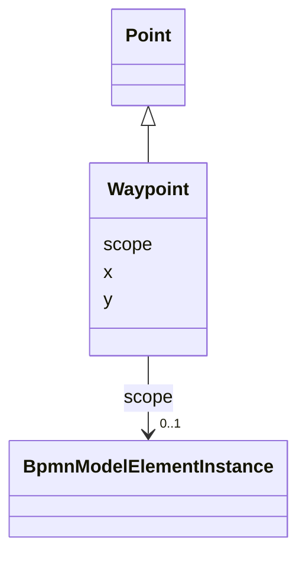

---
search:
  boost: 10.0
---

# Class: Waypoint 


_The DI waypoint element of the DI Edge type_


<div data-search-exclude markdown="1">


URI: [fluxnova_bpm_platform:Waypoint](https://w3id.org/TD-Universe/fluxnova-bpm-platform/Waypoint)





## Inheritance
* [BpmnModelElementInstance](BpmnModelElementInstance.md)
    * [Point](Point.md)
        * **Waypoint**


## Slots

| Name | Cardinality and Range | Description | Inheritance |
| ---  | --- | --- | --- |
| [x](x.md) | 0..1 <br/> [Float](Float.md) | X coordinate (horizontal offset) of this element's bounds | [Point](Point.md) |
| [y](y.md) | 0..1 <br/> [Float](Float.md) | Y coordinate (vertical offset) of this element's bounds | [Point](Point.md) |
| [scope](scope.md) | 0..1 <br/> [BpmnModelElementInstance](BpmnModelElementInstance.md) | Tests if the element is a scope like process or sub-process | [BpmnModelElementInstance](BpmnModelElementInstance.md) |


## Usages

| used by | used in | type | used |
| ---  | --- | --- | --- |
| [Edge](Edge.md) | [waypoints](waypoints.md) | range | [Waypoint](Waypoint.md) |
| [LabeledEdge](LabeledEdge.md) | [waypoints](waypoints.md) | range | [Waypoint](Waypoint.md) |
| [BpmnEdge](BpmnEdge.md) | [waypoints](waypoints.md) | range | [Waypoint](Waypoint.md) |


## In Subsets


* [Di](Di.md)
* [FluxnovaBpmnModel](FluxnovaBpmnModel.md)


## Identifier and Mapping Information


### Annotations

| property | value |
| --- | --- |
| java_package | org.finos.fluxnova.bpm.model.bpmn.instance.di |
| source_file | model-api/bpmn-model/src/main/java/org/finos/fluxnova/bpm/model/bpmn/instance/di/Waypoint.java |


### Schema Source


* from schema: https://w3id.org/TD-Universe/fluxnova-bpm-platform


## Mappings

| Mapping Type | Mapped Value |
| ---  | ---  |
| self | fluxnova_bpm_platform:Waypoint |
| native | fluxnova_bpm_platform:Waypoint |


## LinkML Source

<!-- TODO: investigate https://stackoverflow.com/questions/37606292/how-to-create-tabbed-code-blocks-in-mkdocs-or-sphinx -->

### Direct

<details>
```yaml
name: Waypoint
annotations:
  java_package:
    tag: java_package
    value: org.finos.fluxnova.bpm.model.bpmn.instance.di
  source_file:
    tag: source_file
    value: model-api/bpmn-model/src/main/java/org/finos/fluxnova/bpm/model/bpmn/instance/di/Waypoint.java
description: The DI waypoint element of the DI Edge type
in_subset:
- di
- fluxnova_bpmn_model
from_schema: https://w3id.org/TD-Universe/fluxnova-bpm-platform
is_a: Point

```
</details>

### Induced

<details>
```yaml
name: Waypoint
annotations:
  java_package:
    tag: java_package
    value: org.finos.fluxnova.bpm.model.bpmn.instance.di
  source_file:
    tag: source_file
    value: model-api/bpmn-model/src/main/java/org/finos/fluxnova/bpm/model/bpmn/instance/di/Waypoint.java
description: The DI waypoint element of the DI Edge type
in_subset:
- di
- fluxnova_bpmn_model
from_schema: https://w3id.org/TD-Universe/fluxnova-bpm-platform
is_a: Point
attributes:
  x:
    name: x
    description: X coordinate (horizontal offset) of this element's bounds.
    from_schema: https://w3id.org/TD-Universe/fluxnova-bpm-platform
    rank: 1000
    owner: Waypoint
    domain_of:
    - Bounds
    - Point
    range: float
  y:
    name: y
    description: Y coordinate (vertical offset) of this element's bounds.
    from_schema: https://w3id.org/TD-Universe/fluxnova-bpm-platform
    rank: 1000
    owner: Waypoint
    domain_of:
    - Bounds
    - Point
    range: float
  scope:
    name: scope
    description: Tests if the element is a scope like process or sub-process.
    from_schema: https://w3id.org/TD-Universe/fluxnova-bpm-platform
    rank: 1000
    owner: Waypoint
    domain_of:
    - BpmnModelElementInstance
    range: BpmnModelElementInstance

```
</details></div>